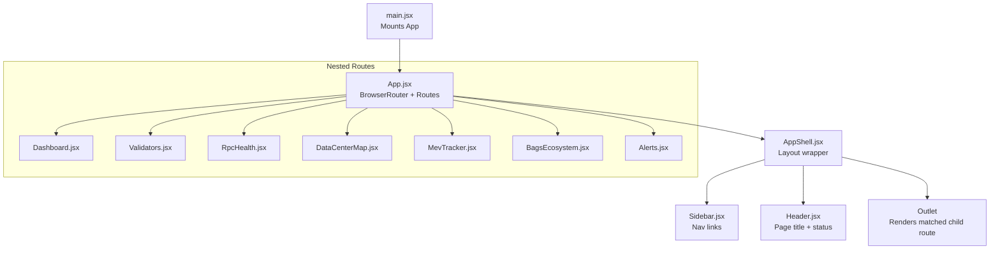
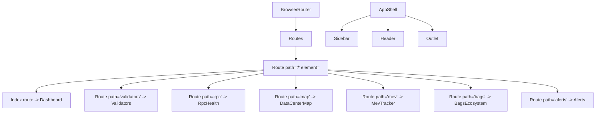
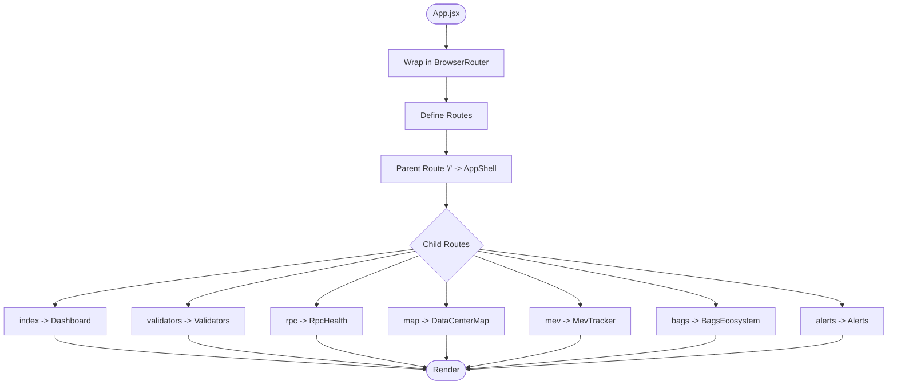
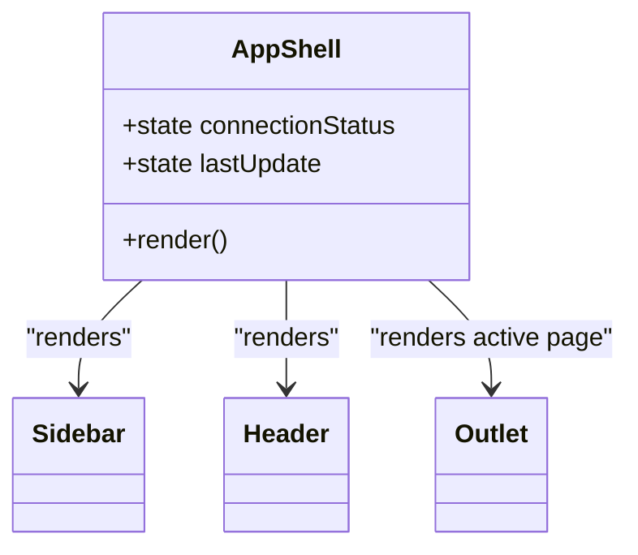
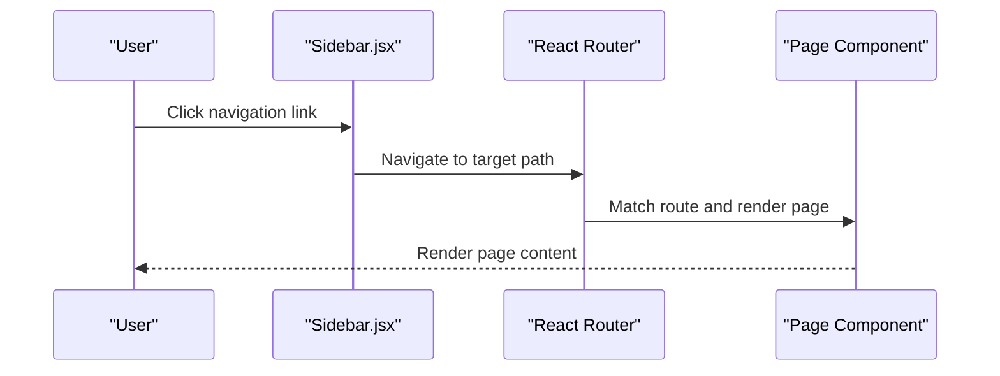
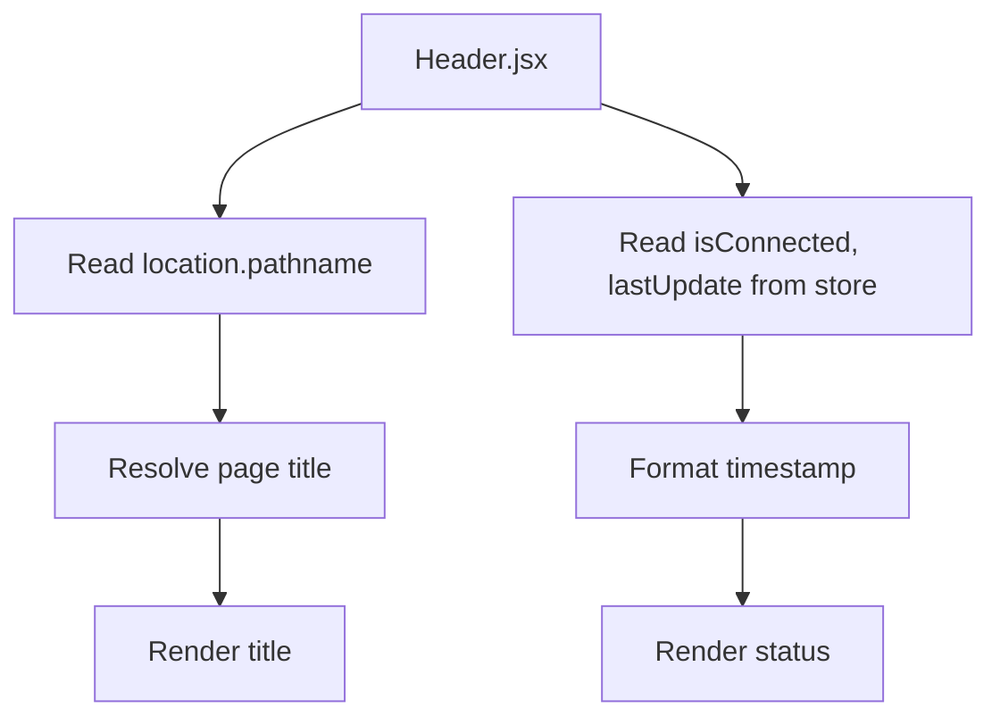
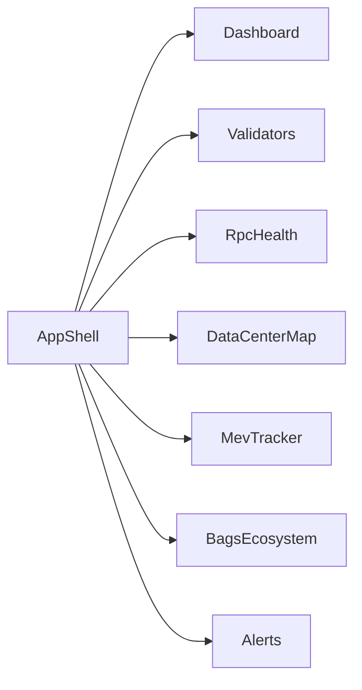
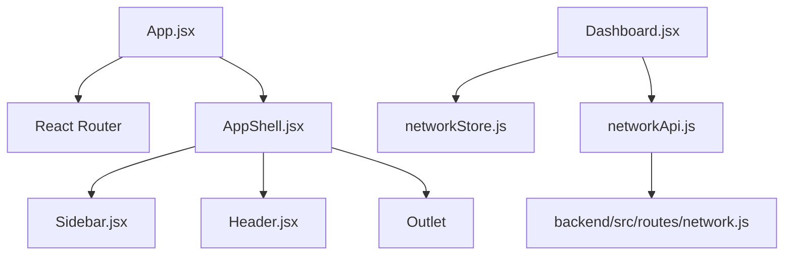

# Routing & Navigation

<cite>
**Referenced Files in This Document**
- [App.jsx](file://frontend/src/App.jsx)
- [main.jsx](file://frontend/src/main.jsx)
- [AppShell.jsx](file://frontend/src/components/layout/AppShell.jsx)
- [Header.jsx](file://frontend/src/components/layout/Header.jsx)
- [Sidebar.jsx](file://frontend/src/components/layout/Sidebar.jsx)
- [Dashboard.jsx](file://frontend/src/pages/Dashboard.jsx)
- [Validators.jsx](file://frontend/src/pages/Validators.jsx)
- [RpcHealth.jsx](file://frontend/src/pages/RpcHealth.jsx)
- [DataCenterMap.jsx](file://frontend/src/pages/DataCenterMap.jsx)
- [MevTracker.jsx](file://frontend/src/pages/MevTracker.jsx)
- [BagsEcosystem.jsx](file://frontend/src/pages/BagsEcosystem.jsx)
- [Alerts.jsx](file://frontend/src/pages/Alerts.jsx)
- [networkStore.js](file://frontend/src/stores/networkStore.js)
- [networkApi.js](file://frontend/src/services/networkApi.js)
- [network.js](file://backend/src/routes/network.js)
</cite>

## Table of Contents
1. [Introduction](#introduction)
2. [Project Structure](#project-structure)
3. [Core Components](#core-components)
4. [Architecture Overview](#architecture-overview)
5. [Detailed Component Analysis](#detailed-component-analysis)
6. [Dependency Analysis](#dependency-analysis)
7. [Performance Considerations](#performance-considerations)
8. [Troubleshooting Guide](#troubleshooting-guide)
9. [Conclusion](#conclusion)

## Introduction
This document explains the routing and navigation architecture for InfraWatch. It covers the React Router configuration, the AppShell layout wrapper, page components, nested routing, route parameters, and navigation patterns. It also documents how the layout remains consistent across pages via the header and sidebar, how programmatic navigation works, URL parameter handling, and responsive navigation behaviors. Finally, it outlines UX patterns such as breadcrumbs and route guards.

## Project Structure
InfraWatch uses React Router v6+ with a single route tree configured in the root App component. The main layout is provided by AppShell, which embeds Sidebar and Header and renders the active page via Outlet. Each feature area is represented by a dedicated page component.

**Diagram sources**
- [main.jsx:1-12](file://frontend/src/main.jsx#L1-L12)
- [App.jsx:1-31](file://frontend/src/App.jsx#L1-L31)
- [AppShell.jsx:1-40](file://frontend/src/components/layout/AppShell.jsx#L1-L40)
- [Sidebar.jsx:1-78](file://frontend/src/components/layout/Sidebar.jsx#L1-L78)
- [Header.jsx:1-70](file://frontend/src/components/layout/Header.jsx#L1-L70)
- [Dashboard.jsx:1-84](file://frontend/src/pages/Dashboard.jsx#L1-L84)
- [Validators.jsx:1-179](file://frontend/src/pages/Validators.jsx#L1-L179)
- [RpcHealth.jsx:1-195](file://frontend/src/pages/RpcHealth.jsx#L1-L195)
- [DataCenterMap.jsx:1-44](file://frontend/src/pages/DataCenterMap.jsx#L1-L44)
- [MevTracker.jsx:1-43](file://frontend/src/pages/MevTracker.jsx#L1-L43)
- [BagsEcosystem.jsx:1-35](file://frontend/src/pages/BagsEcosystem.jsx#L1-L35)
- [Alerts.jsx:1-113](file://frontend/src/pages/Alerts.jsx#L1-L113)

**Section sources**
- [App.jsx:1-31](file://frontend/src/App.jsx#L1-L31)
- [main.jsx:1-12](file://frontend/src/main.jsx#L1-L12)

## Core Components
- App: Configures BrowserRouter, defines the primary route tree, and nests all feature pages under AppShell.
- AppShell: Provides the global layout (sidebar, header, main content area) and renders the active page via Outlet.
- Sidebar: Supplies persistent navigation links using NavLink and highlights the active route.
- Header: Displays the current page title and connection status, pulling live update timestamps from the network store.
- Pages: Feature-specific components rendered inside AppShell.

**Section sources**
- [App.jsx:12-28](file://frontend/src/App.jsx#L12-L28)
- [AppShell.jsx:6-39](file://frontend/src/components/layout/AppShell.jsx#L6-L39)
- [Sidebar.jsx:14-77](file://frontend/src/components/layout/Sidebar.jsx#L14-L77)
- [Header.jsx:16-68](file://frontend/src/components/layout/Header.jsx#L16-L68)

## Architecture Overview
The routing architecture is flat at the top level but nested under AppShell. AppShell acts as a layout shell around all routes, ensuring consistent header and sidebar behavior. The Outlet renders the matching child route’s component.

**Diagram sources**
- [App.jsx:14-25](file://frontend/src/App.jsx#L14-L25)
- [AppShell.jsx:19-38](file://frontend/src/components/layout/AppShell.jsx#L19-L38)

## Detailed Component Analysis

### App.jsx: Root Routing Configuration
- Wraps the app in BrowserRouter.
- Declares a single parent route with path="/" that renders AppShell.
- Defines seven child routes under AppShell for each feature area.
- Uses index to render Dashboard as the default page.

**Diagram sources**
- [App.jsx:14-25](file://frontend/src/App.jsx#L14-L25)

**Section sources**
- [App.jsx:12-28](file://frontend/src/App.jsx#L12-L28)

### AppShell.jsx: Layout Wrapper
- Renders Sidebar and Header.
- Provides a main content area with padding and overflow handling.
- Uses Outlet to render the active child route’s component.
- Manages a simulated connection status and periodic timestamp updates.

**Diagram sources**
- [AppShell.jsx:6-39](file://frontend/src/components/layout/AppShell.jsx#L6-L39)

**Section sources**
- [AppShell.jsx:6-39](file://frontend/src/components/layout/AppShell.jsx#L6-L39)

### Sidebar.jsx: Persistent Navigation
- Defines a fixed-width sidebar with logo and navigation items.
- Uses NavLink to create links for each route.
- Highlights the active route based on location.
- Responsive layout via Tailwind utilities.

**Diagram sources**
- [Sidebar.jsx:42-66](file://frontend/src/components/layout/Sidebar.jsx#L42-L66)

**Section sources**
- [Sidebar.jsx:14-77](file://frontend/src/components/layout/Sidebar.jsx#L14-L77)

### Header.jsx: Page Title and Status
- Displays the current page title derived from the current pathname.
- Shows connection status and last update timestamp.
- Reads lastUpdate from the network store.

**Diagram sources**
- [Header.jsx:6-31](file://frontend/src/components/layout/Header.jsx#L6-L31)
- [Header.jsx:20-31](file://frontend/src/components/layout/Header.jsx#L20-L31)

**Section sources**
- [Header.jsx:16-68](file://frontend/src/components/layout/Header.jsx#L16-L68)

### Page Components: Feature Areas
- Dashboard: Renders network metrics and charts; initializes WebSocket and data fetching.
- Validators: Displays validator rankings with sorting and selection; periodically refreshes data.
- RpcHealth: Shows RPC provider health; integrates WebSocket updates and local sorting.
- DataCenterMap: Placeholder for geographic visualization.
- MevTracker: Placeholder for MEV metrics.
- BagsEcosystem: Placeholder for whale tracking.
- Alerts: Displays alert statistics and list.

**Diagram sources**
- [App.jsx:16-24](file://frontend/src/App.jsx#L16-L24)
- [Dashboard.jsx:19-83](file://frontend/src/pages/Dashboard.jsx#L19-L83)
- [Validators.jsx:8-178](file://frontend/src/pages/Validators.jsx#L8-L178)
- [RpcHealth.jsx:9-194](file://frontend/src/pages/RpcHealth.jsx#L9-L194)
- [DataCenterMap.jsx:4-43](file://frontend/src/pages/DataCenterMap.jsx#L4-L43)
- [MevTracker.jsx:4-42](file://frontend/src/pages/MevTracker.jsx#L4-L42)
- [BagsEcosystem.jsx:4-34](file://frontend/src/pages/BagsEcosystem.jsx#L4-L34)
- [Alerts.jsx:40-112](file://frontend/src/pages/Alerts.jsx#L40-L112)

**Section sources**
- [Dashboard.jsx:19-83](file://frontend/src/pages/Dashboard.jsx#L19-L83)
- [Validators.jsx:8-178](file://frontend/src/pages/Validators.jsx#L8-L178)
- [RpcHealth.jsx:9-194](file://frontend/src/pages/RpcHealth.jsx#L9-L194)
- [DataCenterMap.jsx:4-43](file://frontend/src/pages/DataCenterMap.jsx#L4-L43)
- [MevTracker.jsx:4-42](file://frontend/src/pages/MevTracker.jsx#L4-L42)
- [BagsEcosystem.jsx:4-34](file://frontend/src/pages/BagsEcosystem.jsx#L4-L34)
- [Alerts.jsx:40-112](file://frontend/src/pages/Alerts.jsx#L40-L112)

## Dependency Analysis
- App depends on React Router for routing and on AppShell for layout.
- AppShell depends on Sidebar and Header and renders the active page via Outlet.
- Pages depend on services and stores for data and state.
- Backend route for network history validates and returns query parameters.

**Diagram sources**
- [App.jsx:2-4](file://frontend/src/App.jsx#L2-L4)
- [AppShell.jsx:2-4](file://frontend/src/components/layout/AppShell.jsx#L2-L4)
- [Sidebar.jsx:2](file://frontend/src/components/layout/Sidebar.jsx#L2)
- [Header.jsx:2](file://frontend/src/components/layout/Header.jsx#L2)
- [Dashboard.jsx:3-4](file://frontend/src/pages/Dashboard.jsx#L3-L4)
- [networkStore.js:1-25](file://frontend/src/stores/networkStore.js#L1-L25)
- [networkApi.js:1-6](file://frontend/src/services/networkApi.js#L1-L6)
- [network.js:85-134](file://backend/src/routes/network.js#L85-L134)

**Section sources**
- [networkApi.js:1-6](file://frontend/src/services/networkApi.js#L1-L6)
- [network.js:85-134](file://backend/src/routes/network.js#L85-L134)

## Performance Considerations
- Outlet rendering ensures minimal re-renders when switching between nested routes.
- Sidebar and Header are static; they avoid unnecessary computations.
- Pages implement periodic data refresh and local sorting to keep UI responsive.
- WebSocket updates in RpcHealth reduce polling overhead for real-time data.

[No sources needed since this section provides general guidance]

## Troubleshooting Guide
- If a page does not render under AppShell, verify the route path matches the Sidebar and App nesting.
- If the active link highlight is incorrect, confirm the NavLink path matches the route path.
- If the page title is missing, check the pageTitles mapping in Header for the corresponding pathname.
- If network history requests fail, validate the range query parameter against accepted values.

**Section sources**
- [Header.jsx:6-18](file://frontend/src/components/layout/Header.jsx#L6-L18)
- [network.js:89-96](file://backend/src/routes/network.js#L89-L96)

## Conclusion
InfraWatch employs a clean, nested routing pattern with AppShell as the central layout provider. Sidebar and Header remain consistent across pages, while each feature area is encapsulated in its own page component. The architecture supports straightforward programmatic navigation, responsive layouts, and clear UX patterns such as active link highlighting and page titles. URL parameters are handled at the backend for validated inputs, and real-time updates are integrated via WebSocket where applicable.