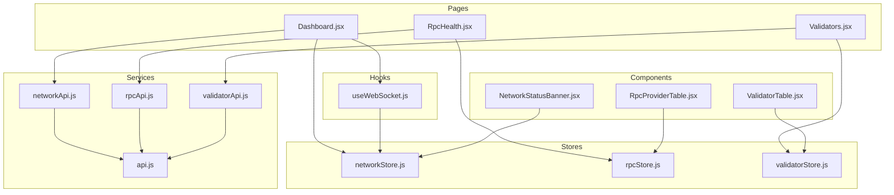
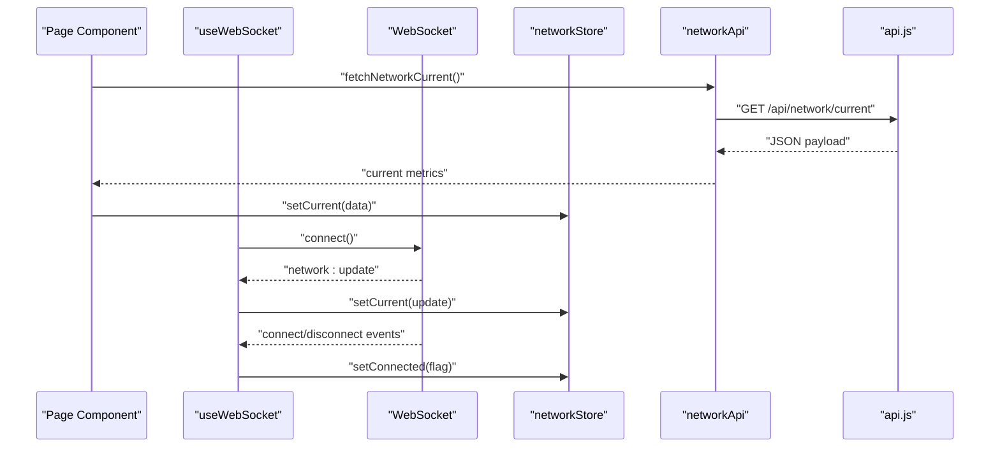
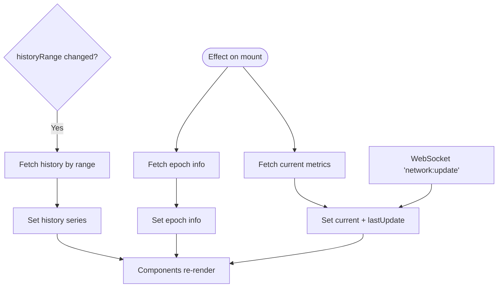
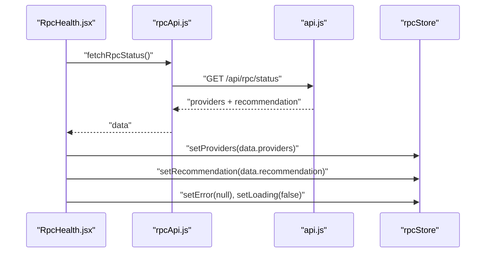
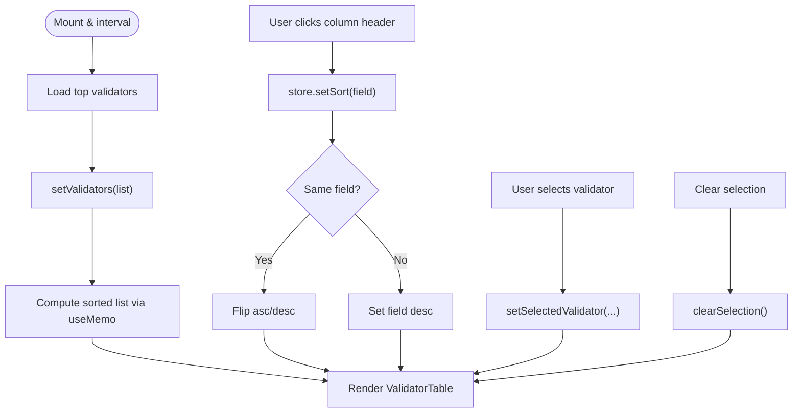
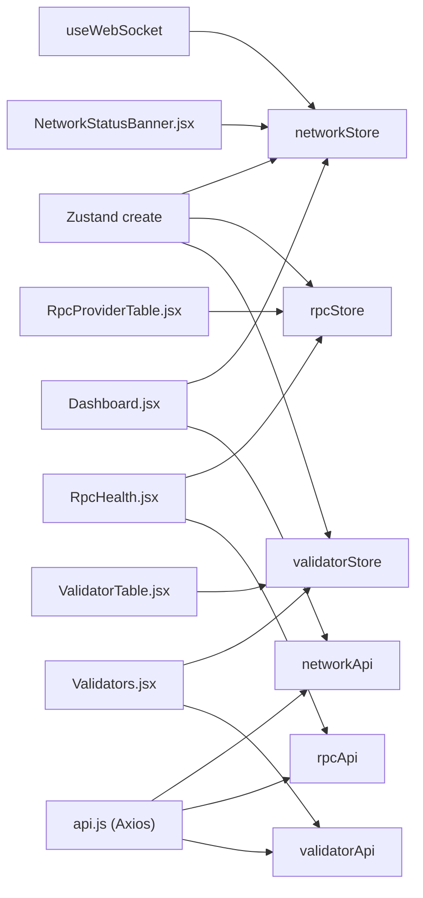

# State Management

<cite>
**Referenced Files in This Document**
- [networkStore.js](file://frontend/src/stores/networkStore.js)
- [rpcStore.js](file://frontend/src/stores/rpcStore.js)
- [validatorStore.js](file://frontend/src/stores/validatorStore.js)
- [networkApi.js](file://frontend/src/services/networkApi.js)
- [rpcApi.js](file://frontend/src/services/rpcApi.js)
- [validatorApi.js](file://frontend/src/services/validatorApi.js)
- [api.js](file://frontend/src/services/api.js)
- [useWebSocket.js](file://frontend/src/hooks/useWebSocket.js)
- [Dashboard.jsx](file://frontend/src/pages/Dashboard.jsx)
- [RpcHealth.jsx](file://frontend/src/pages/RpcHealth.jsx)
- [Validators.jsx](file://frontend/src/pages/Validators.jsx)
- [NetworkStatusBanner.jsx](file://frontend/src/components/dashboard/NetworkStatusBanner.jsx)
- [ValidatorTable.jsx](file://frontend/src/components/validators/ValidatorTable.jsx)
- [RpcProviderTable.jsx](file://frontend/src/components/rpc/RpcProviderTable.jsx)
</cite>

## Table of Contents
1. [Introduction](#introduction)
2. [Project Structure](#project-structure)
3. [Core Components](#core-components)
4. [Architecture Overview](#architecture-overview)
5. [Detailed Component Analysis](#detailed-component-analysis)
6. [Dependency Analysis](#dependency-analysis)
7. [Performance Considerations](#performance-considerations)
8. [Troubleshooting Guide](#troubleshooting-guide)
9. [Conclusion](#conclusion)

## Introduction
This document explains the state management architecture for InfraWatch using Zustand stores. It covers three primary stores:
- networkStore: centralizes network-wide metrics, epoch info, connection status, and historical series.
- rpcStore: manages RPC provider health data, recommendations, and loading/error states.
- validatorStore: maintains validator rankings, selection state, sorting preferences, and loading/error states.

It details store structure, state shape, actions, selectors, integration with React components via hooks, subscription patterns, performance optimizations, persistence strategies, initialization, cleanup, usage examples, state update patterns, and debugging techniques.

## Project Structure
The state layer is organized around small, focused Zustand stores under the stores directory. Services encapsulate API calls, and pages/components subscribe to store slices via hooks. A WebSocket hook updates network metrics in real-time.

**Diagram sources**
- [networkStore.js:1-25](file://frontend/src/stores/networkStore.js#L1-L25)
- [rpcStore.js:1-16](file://frontend/src/stores/rpcStore.js#L1-L16)
- [validatorStore.js:1-28](file://frontend/src/stores/validatorStore.js#L1-L28)
- [networkApi.js:1-6](file://frontend/src/services/networkApi.js#L1-L6)
- [rpcApi.js:1-7](file://frontend/src/services/rpcApi.js#L1-L7)
- [validatorApi.js:1-8](file://frontend/src/services/validatorApi.js#L1-L8)
- [api.js:1-43](file://frontend/src/services/api.js#L1-L43)
- [useWebSocket.js:1-30](file://frontend/src/hooks/useWebSocket.js#L1-L30)
- [Dashboard.jsx:1-84](file://frontend/src/pages/Dashboard.jsx#L1-L84)
- [RpcHealth.jsx:1-153](file://frontend/src/pages/RpcHealth.jsx#L1-L153)
- [Validators.jsx:1-179](file://frontend/src/pages/Validators.jsx#L1-L179)
- [NetworkStatusBanner.jsx:1-101](file://frontend/src/components/dashboard/NetworkStatusBanner.jsx#L1-L101)
- [ValidatorTable.jsx:1-202](file://frontend/src/components/validators/ValidatorTable.jsx#L1-L202)
- [RpcProviderTable.jsx:1-177](file://frontend/src/components/rpc/RpcProviderTable.jsx#L1-L177)

**Section sources**
- [networkStore.js:1-25](file://frontend/src/stores/networkStore.js#L1-L25)
- [rpcStore.js:1-16](file://frontend/src/stores/rpcStore.js#L1-L16)
- [validatorStore.js:1-28](file://frontend/src/stores/validatorStore.js#L1-L28)
- [networkApi.js:1-6](file://frontend/src/services/networkApi.js#L1-L6)
- [rpcApi.js:1-7](file://frontend/src/services/rpcApi.js#L1-L7)
- [validatorApi.js:1-8](file://frontend/src/services/validatorApi.js#L1-L8)
- [api.js:1-43](file://frontend/src/services/api.js#L1-L43)
- [useWebSocket.js:1-30](file://frontend/src/hooks/useWebSocket.js#L1-L30)
- [Dashboard.jsx:1-84](file://frontend/src/pages/Dashboard.jsx#L1-L84)
- [RpcHealth.jsx:1-153](file://frontend/src/pages/RpcHealth.jsx#L1-L153)
- [Validators.jsx:1-179](file://frontend/src/pages/Validators.jsx#L1-L179)
- [NetworkStatusBanner.jsx:1-101](file://frontend/src/components/dashboard/NetworkStatusBanner.jsx#L1-L101)
- [ValidatorTable.jsx:1-202](file://frontend/src/components/validators/ValidatorTable.jsx#L1-L202)
- [RpcProviderTable.jsx:1-177](file://frontend/src/components/rpc/RpcProviderTable.jsx#L1-L177)

## Core Components
This section documents each store’s state shape, actions, and selectors, and how they are consumed by components.

- networkStore
  - State shape
    - current: object | null — latest network metrics snapshot
    - history: array — time-series data for charts
    - epochInfo: object | null — current epoch metadata
    - isConnected: boolean — WebSocket connection status
    - lastUpdate: date | null — timestamp of last metric update
    - historyRange: string — chart history window selector
  - Actions
    - setCurrent(data): sets current and updates lastUpdate
    - setHistory(data): sets historical series
    - setEpochInfo(data): sets epoch metadata
    - setConnected(connected): toggles connection flag
    - setHistoryRange(range): updates chart window
  - Selectors
    - current, history, epochInfo, isConnected, lastUpdate, historyRange

- rpcStore
  - State shape
    - providers: array — provider health entries
    - recommendation: object | null — recommended provider
    - loading: boolean — indicates async operation
    - error: string | null — last error message
  - Actions
    - setProviders(providers): replaces provider list and clears loading
    - setRecommendation(rec): sets recommendation
    - setLoading(loading): toggles loading
    - setError(error): sets error and clears loading

- validatorStore
  - State shape
    - validators: array — ranked validators
    - selectedValidator: object | null — currently selected validator
    - loading: boolean — indicates async operation
    - error: string | null — last error message
    - sortField: string — column used for sorting
    - sortDirection: 'asc' | 'desc' — sort order
    - limit: number — pagination-like cap for lists
  - Actions
    - setValidators(validators): replaces list and clears loading
    - setSelectedValidator(v): selects a validator or clears selection
    - setLoading(loading): toggles loading
    - setError(error): sets error and clears loading
    - setSort(field): flips direction if same field, otherwise sets field descending
    - clearSelection(): deselects validator

**Section sources**
- [networkStore.js:1-25](file://frontend/src/stores/networkStore.js#L1-L25)
- [rpcStore.js:1-16](file://frontend/src/stores/rpcStore.js#L1-L16)
- [validatorStore.js:1-28](file://frontend/src/stores/validatorStore.js#L1-L28)

## Architecture Overview
The state architecture follows a unidirectional data flow:
- Pages call service functions to fetch data.
- Services use a shared Axios client with interceptors.
- Store actions update state slices.
- Components subscribe to store slices via hooks and re-render efficiently.
- A WebSocket hook pushes live network updates into the network store.

**Diagram sources**
- [Dashboard.jsx:32-47](file://frontend/src/pages/Dashboard.jsx#L32-L47)
- [useWebSocket.js:8-28](file://frontend/src/hooks/useWebSocket.js#L8-L28)
- [networkApi.js:3-5](file://frontend/src/services/networkApi.js#L3-L5)
- [api.js:1-43](file://frontend/src/services/api.js#L1-L43)
- [networkStore.js:17-21](file://frontend/src/stores/networkStore.js#L17-L21)

**Section sources**
- [Dashboard.jsx:19-47](file://frontend/src/pages/Dashboard.jsx#L19-L47)
- [useWebSocket.js:5-28](file://frontend/src/hooks/useWebSocket.js#L5-L28)
- [networkApi.js:1-6](file://frontend/src/services/networkApi.js#L1-L6)
- [api.js:1-43](file://frontend/src/services/api.js#L1-L43)
- [networkStore.js:1-25](file://frontend/src/stores/networkStore.js#L1-L25)

## Detailed Component Analysis

### networkStore
- Purpose: Central hub for network metrics, history, epoch info, and connection status.
- Subscriptions: Pages and components consume current, historyRange, and actions.
- Real-time updates: WebSocket hook dispatches setCurrent and setConnected.
- Persistence: No persistence is implemented in the store itself.

**Diagram sources**
- [Dashboard.jsx:32-47](file://frontend/src/pages/Dashboard.jsx#L32-L47)
- [useWebSocket.js:21-23](file://frontend/src/hooks/useWebSocket.js#L21-L23)
- [networkStore.js:17-21](file://frontend/src/stores/networkStore.js#L17-L21)

**Section sources**
- [networkStore.js:1-25](file://frontend/src/stores/networkStore.js#L1-L25)
- [Dashboard.jsx:19-47](file://frontend/src/pages/Dashboard.jsx#L19-L47)
- [useWebSocket.js:5-28](file://frontend/src/hooks/useWebSocket.js#L5-L28)

### rpcStore
- Purpose: Manage RPC provider health data, recommendations, and loading states.
- Subscriptions: RpcHealth page consumes providers, recommendation, loading, error, and actions.
- Sorting: Local component state controls sortField and sortDirection; table component receives onSort callback.
- Persistence: No persistence is implemented in the store itself.

**Diagram sources**
- [RpcHealth.jsx:23-33](file://frontend/src/pages/RpcHealth.jsx#L23-L33)
- [rpcApi.js:3-6](file://frontend/src/services/rpcApi.js#L3-L6)
- [api.js:1-43](file://frontend/src/services/api.js#L1-L43)
- [rpcStore.js:9-12](file://frontend/src/stores/rpcStore.js#L9-L12)

**Section sources**
- [rpcStore.js:1-16](file://frontend/src/stores/rpcStore.js#L1-L16)
- [RpcHealth.jsx:8-39](file://frontend/src/pages/RpcHealth.jsx#L8-L39)
- [rpcApi.js:1-7](file://frontend/src/services/rpcApi.js#L1-L7)
- [api.js:1-43](file://frontend/src/services/api.js#L1-L43)

### validatorStore
- Purpose: Maintain validator rankings, selection, sorting, and loading/error states.
- Subscriptions: Validators page consumes validators, selectedValidator, sortField, sortDirection, and actions.
- Sorting: Store action setSort toggles direction for the same field or sets a new field descending.
- Persistence: No persistence is implemented in the store itself.

**Diagram sources**
- [Validators.jsx:24-51](file://frontend/src/pages/Validators.jsx#L24-L51)
- [validatorStore.js:16-25](file://frontend/src/stores/validatorStore.js#L16-L25)
- [ValidatorTable.jsx:45-47](file://frontend/src/components/validators/ValidatorTable.jsx#L45-L47)

**Section sources**
- [validatorStore.js:1-28](file://frontend/src/stores/validatorStore.js#L1-L28)
- [Validators.jsx:8-51](file://frontend/src/pages/Validators.jsx#L8-L51)
- [ValidatorTable.jsx:35-51](file://frontend/src/components/validators/ValidatorTable.jsx#L35-L51)

### Component Integration Patterns
- Dashboard
  - Subscribes to networkStore for current metrics and historyRange.
  - Initializes WebSocket and fetches current and epoch data on mount.
  - Renders NetworkStatusBanner and other cards that read from networkStore.
- RpcHealth
  - Subscribes to rpcStore for providers and recommendation.
  - Manages local sort state and passes callbacks to RpcProviderTable.
- Validators
  - Subscribes to validatorStore for validators, selection, and sort settings.
  - Computes sorted validators via useMemo and passes to ValidatorTable.

**Section sources**
- [Dashboard.jsx:19-82](file://frontend/src/pages/Dashboard.jsx#L19-L82)
- [NetworkStatusBanner.jsx:33-35](file://frontend/src/components/dashboard/NetworkStatusBanner.jsx#L33-L35)
- [RpcHealth.jsx:8-151](file://frontend/src/pages/RpcHealth.jsx#L8-L151)
- [RpcProviderTable.jsx:39-77](file://frontend/src/components/rpc/RpcProviderTable.jsx#L39-L77)
- [Validators.jsx:8-178](file://frontend/src/pages/Validators.jsx#L8-L178)
- [ValidatorTable.jsx:35-51](file://frontend/src/components/validators/ValidatorTable.jsx#L35-L51)

## Dependency Analysis
- Stores depend on Zustand create for state creation.
- Pages depend on services for data fetching and on stores for state.
- Services depend on a shared Axios client with interceptors.
- WebSocket hook depends on socket.io-client and networkStore actions.
- Components depend on store slices via hooks and pass callbacks to child components.

**Diagram sources**
- [networkStore.js:1-25](file://frontend/src/stores/networkStore.js#L1-L25)
- [rpcStore.js:1-16](file://frontend/src/stores/rpcStore.js#L1-L16)
- [validatorStore.js:1-28](file://frontend/src/stores/validatorStore.js#L1-L28)
- [api.js:1-43](file://frontend/src/services/api.js#L1-L43)
- [networkApi.js:1-6](file://frontend/src/services/networkApi.js#L1-L6)
- [rpcApi.js:1-7](file://frontend/src/services/rpcApi.js#L1-L7)
- [validatorApi.js:1-8](file://frontend/src/services/validatorApi.js#L1-L8)
- [useWebSocket.js:1-30](file://frontend/src/hooks/useWebSocket.js#L1-L30)
- [Dashboard.jsx:1-84](file://frontend/src/pages/Dashboard.jsx#L1-L84)
- [RpcHealth.jsx:1-153](file://frontend/src/pages/RpcHealth.jsx#L1-L153)
- [Validators.jsx:1-179](file://frontend/src/pages/Validators.jsx#L1-L179)
- [NetworkStatusBanner.jsx:1-101](file://frontend/src/components/dashboard/NetworkStatusBanner.jsx#L1-L101)
- [ValidatorTable.jsx:1-202](file://frontend/src/components/validators/ValidatorTable.jsx#L1-L202)
- [RpcProviderTable.jsx:1-177](file://frontend/src/components/rpc/RpcProviderTable.jsx#L1-L177)

**Section sources**
- [networkStore.js:1-25](file://frontend/src/stores/networkStore.js#L1-L25)
- [rpcStore.js:1-16](file://frontend/src/stores/rpcStore.js#L1-L16)
- [validatorStore.js:1-28](file://frontend/src/stores/validatorStore.js#L1-L28)
- [api.js:1-43](file://frontend/src/services/api.js#L1-L43)
- [networkApi.js:1-6](file://frontend/src/services/networkApi.js#L1-L6)
- [rpcApi.js:1-7](file://frontend/src/services/rpcApi.js#L1-L7)
- [validatorApi.js:1-8](file://frontend/src/services/validatorApi.js#L1-L8)
- [useWebSocket.js:1-30](file://frontend/src/hooks/useWebSocket.js#L1-L30)
- [Dashboard.jsx:1-84](file://frontend/src/pages/Dashboard.jsx#L1-L84)
- [RpcHealth.jsx:1-153](file://frontend/src/pages/RpcHealth.jsx#L1-L153)
- [Validators.jsx:1-179](file://frontend/src/pages/Validators.jsx#L1-L179)
- [NetworkStatusBanner.jsx:1-101](file://frontend/src/components/dashboard/NetworkStatusBanner.jsx#L1-L101)
- [ValidatorTable.jsx:1-202](file://frontend/src/components/validators/ValidatorTable.jsx#L1-L202)
- [RpcProviderTable.jsx:1-177](file://frontend/src/components/rpc/RpcProviderTable.jsx#L1-L177)

## Performance Considerations
- Efficient re-renders
  - Components subscribe to minimal slices of state via hooks to avoid unnecessary renders.
  - useMemo is used in pages to compute derived data (e.g., sorted validators) only when dependencies change.
- Debouncing and throttling
  - Intervals are used for periodic polling; ensure intervals are cleared on unmount to prevent leaks.
- Rendering optimizations
  - Child components receive only required props (e.g., onSort, sortField, sortDirection) to keep render trees lean.
- Network efficiency
  - historyRange updates trigger targeted history fetches rather than reloading all data.
- Memory hygiene
  - WebSocket cleanup disconnects on hook teardown to prevent dangling connections.

[No sources needed since this section provides general guidance]

## Troubleshooting Guide
- Common issues and resolutions
  - No data displayed
    - Verify initial fetches are called on mount and that setCurrent/setProviders/setValidators are invoked with the returned data.
    - Check loading flags and error messages to detect failures.
  - Stale or missing live updates
    - Confirm the WebSocket hook connects and emits network:update events.
    - Ensure setConnected and setCurrent are called on connect/disconnect and update events.
  - Sorting not working
    - For validators, confirm setSort is called and that sortField/sortDirection are used to compute the sorted list.
    - For RPC providers, ensure local sort state is updated and passed to RpcProviderTable.
  - API errors
    - Inspect the shared Axios interceptors for logged error details and surface user-friendly messages.
- Debugging techniques
  - Log store slices in components to verify updates.
  - Temporarily disable intervals and rely on manual retries to isolate timing issues.
  - Use browser devtools to inspect WebSocket frames and network requests.
  - Add console logs in service functions to trace request/response flows.

**Section sources**
- [Dashboard.jsx:32-47](file://frontend/src/pages/Dashboard.jsx#L32-L47)
- [RpcHealth.jsx:23-39](file://frontend/src/pages/RpcHealth.jsx#L23-L39)
- [Validators.jsx:24-51](file://frontend/src/pages/Validators.jsx#L24-L51)
- [useWebSocket.js:8-28](file://frontend/src/hooks/useWebSocket.js#L8-L28)
- [api.js:23-40](file://frontend/src/services/api.js#L23-L40)

## Conclusion
InfraWatch employs a clean, modular state management architecture using Zustand stores. Each store encapsulates a domain slice with explicit actions and selectors, enabling predictable updates and efficient component subscriptions. Services abstract API concerns, and pages orchestrate data fetching and scheduling. Real-time updates are handled via a dedicated WebSocket hook. While no persistence is implemented in the stores themselves, the architecture supports easy integration of persistence layers if needed. The combination of useMemo, targeted updates, and careful cleanup ensures responsive and memory-efficient UI behavior.