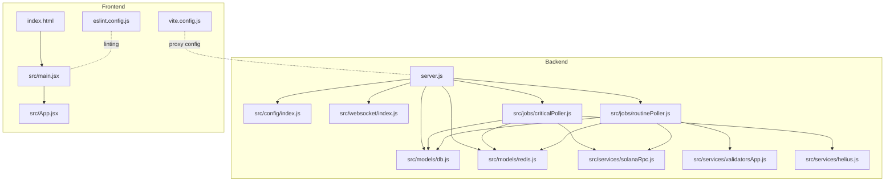
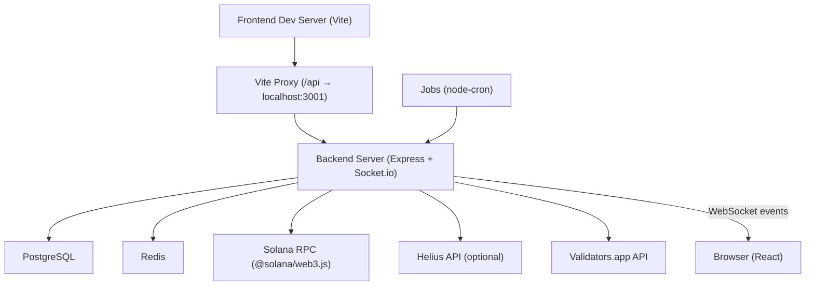
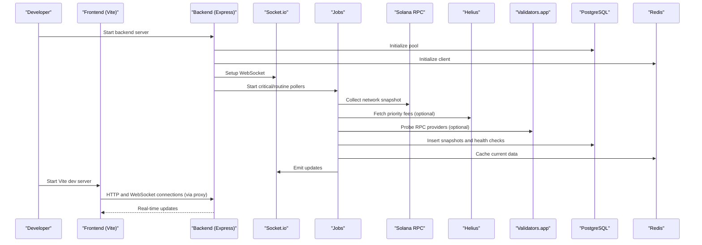
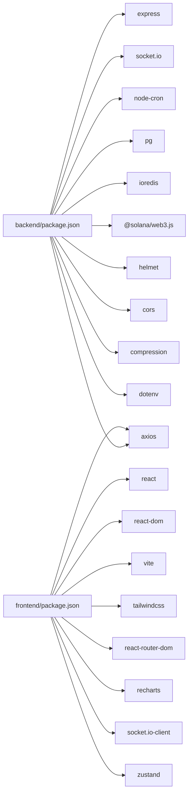

# Getting Started

<cite>
**Referenced Files in This Document**
- [backend/package.json](file://backend/package.json)
- [frontend/package.json](file://frontend/package.json)
- [backend/src/config/index.js](file://backend/src/config/index.js)
- [backend/server.js](file://backend/server.js)
- [backend/src/models/db.js](file://backend/src/models/db.js)
- [backend/src/models/redis.js](file://backend/src/models/redis.js)
- [backend/src/models/migrate.js](file://backend/src/models/migrate.js)
- [backend/src/websocket/index.js](file://backend/src/websocket/index.js)
- [backend/src/jobs/criticalPoller.js](file://backend/src/jobs/criticalPoller.js)
- [backend/src/jobs/routinePoller.js](file://backend/src/jobs/routinePoller.js)
- [backend/src/services/solanaRpc.js](file://backend/src/services/solanaRpc.js)
- [backend/src/services/validatorsApp.js](file://backend/src/services/validatorsApp.js)
- [backend/src/services/helius.js](file://backend/src/services/helius.js)
- [frontend/README.md](file://frontend/README.md)
- [frontend/index.html](file://frontend/index.html)
- [frontend/vite.config.js](file://frontend/vite.config.js)
- [frontend/eslint.config.js](file://frontend/eslint.config.js)
- [.gitignore](file://.gitignore)
</cite>

## Update Summary
**Changes Made**
- Updated environment setup to reflect proper Git initialization and repository structure
- Added HTML structure setup documentation with proper index.html configuration
- Enhanced development file organization patterns for both backend and frontend
- Updated Vite configuration and ESLint setup for modern React development workflow
- Improved local development server startup procedures with proxy configuration

## Table of Contents
1. [Introduction](#introduction)
2. [Repository Setup and Git Initialization](#repository-setup-and-git-initialization)
3. [Project Structure](#project-structure)
4. [Core Components](#core-components)
5. [Architecture Overview](#architecture-overview)
6. [Detailed Component Analysis](#detailed-component-analysis)
7. [Dependency Analysis](#dependency-analysis)
8. [Performance Considerations](#performance-considerations)
9. [Troubleshooting Guide](#troubleshooting-guide)
10. [Conclusion](#conclusion)
11. [Appendices](#appendices)

## Introduction
This guide helps you install, configure, and run InfraWatch locally for both backend and frontend development. InfraWatch monitors Solana infrastructure in real time, collecting network metrics, validator data, and RPC health signals, and serving them via a web dashboard.

You will:
- Initialize the repository with proper Git setup
- Install prerequisites (Node.js, PostgreSQL, Redis)
- Configure environment variables
- Initialize the database with migrations
- Set up HTML structure and development file organization
- Start backend and frontend servers
- Verify the setup and explore basic usage

## Repository Setup and Git Initialization
Before starting development, ensure your repository is properly initialized with Git and follows the established file organization patterns.

### Git Repository Setup
- Initialize Git repository: `git init`
- Add all files to staging: `git add .`
- Create initial commit: `git commit -m "Initial commit: InfraWatch project structure"`
- Verify repository status: `git status`

### File Organization Patterns
The repository follows a monorepo structure with proper separation between backend and frontend:

```
InfraWatch/
├── backend/           # Node.js/Express server
├── frontend/          # React/Vite application
├── .gitignore         # Git ignore patterns
├── .env               # Environment variables (not committed)
└── InfraWatch.txt     # Project description
```

**Section sources**
- [.gitignore](file://.gitignore)
- [frontend/index.html](file://frontend/index.html)

## Project Structure
InfraWatch is split into:
- Backend: Node.js/Express server with Socket.io, cron-based pollers, PostgreSQL, and Redis
- Frontend: React/Vite application with TailwindCSS styling and modern development tools



**Diagram sources**
- [backend/server.js:1-128](file://backend/server.js#L1-L128)
- [backend/src/config/index.js:1-68](file://backend/src/config/index.js#L1-L68)
- [backend/src/websocket/index.js:1-81](file://backend/src/websocket/index.js#L1-L81)
- [backend/src/models/db.js:1-98](file://backend/src/models/db.js#L1-L98)
- [backend/src/models/redis.js:1-161](file://backend/src/models/redis.js#L1-L161)
- [backend/src/jobs/criticalPoller.js:1-108](file://backend/src/jobs/criticalPoller.js#L1-L108)
- [backend/src/jobs/routinePoller.js:1-116](file://backend/src/jobs/routinePoller.js#L1-L116)
- [backend/src/services/solanaRpc.js:1-340](file://backend/src/services/solanaRpc.js#L1-L340)
- [backend/src/services/validatorsApp.js:1-388](file://backend/src/services/validatorsApp.js#L1-L388)
- [backend/src/services/helius.js:1-188](file://backend/src/services/helius.js#L1-L188)
- [frontend/index.html](file://frontend/index.html)
- [frontend/vite.config.js](file://frontend/vite.config.js)
- [frontend/eslint.config.js](file://frontend/eslint.config.js)

**Section sources**
- [backend/server.js:1-128](file://backend/server.js#L1-L128)
- [frontend/package.json:1-39](file://frontend/package.json#L1-L39)

## Core Components
- Backend runtime and routing: server bootstraps Express, Socket.io, applies middleware, mounts routes, initializes data stores, and starts pollers.
- Configuration loader: centralizes environment variables and defaults.
- Data stores: PostgreSQL via pg Pool and Redis via ioredis.
- Jobs: periodic collectors for network snapshots and validator updates.
- Services: Solana RPC client, Validators.app client, Helius integration.
- Frontend HTML structure: proper index.html with favicon and viewport configuration.
- Development tools: Vite for fast development server with proxy support.

**Section sources**
- [backend/server.js:1-128](file://backend/server.js#L1-L128)
- [backend/src/config/index.js:1-68](file://backend/src/config/index.js#L1-L68)
- [backend/src/models/db.js:1-98](file://backend/src/models/db.js#L1-L98)
- [backend/src/models/redis.js:1-161](file://backend/src/models/redis.js#L1-L161)
- [backend/src/jobs/criticalPoller.js:1-108](file://backend/src/jobs/criticalPoller.js#L1-L108)
- [backend/src/jobs/routinePoller.js:1-116](file://backend/src/jobs/routinePoller.js#L1-L116)
- [backend/src/services/solanaRpc.js:1-340](file://backend/src/services/solanaRpc.js#L1-L340)
- [backend/src/services/validatorsApp.js:1-388](file://backend/src/services/validatorsApp.js#L1-L388)
- [backend/src/services/helius.js:1-188](file://backend/src/services/helius.js#L1-L188)
- [frontend/index.html](file://frontend/index.html)

## Architecture Overview
The backend exposes REST endpoints and a WebSocket stream. It periodically polls Solana and external APIs, persists data to PostgreSQL, caches hot data in Redis, and emits real-time events to clients. The frontend uses Vite for development with automatic proxy configuration to the backend server.



**Diagram sources**
- [backend/server.js:1-128](file://backend/server.js#L1-L128)
- [backend/src/jobs/criticalPoller.js:1-108](file://backend/src/jobs/criticalPoller.js#L1-L108)
- [backend/src/jobs/routinePoller.js:1-116](file://backend/src/jobs/routinePoller.js#L1-L116)
- [backend/src/services/solanaRpc.js:1-340](file://backend/src/services/solanaRpc.js#L1-L340)
- [backend/src/services/helius.js:1-188](file://backend/src/services/helius.js#L1-L188)
- [backend/src/services/validatorsApp.js:1-388](file://backend/src/services/validatorsApp.js#L1-L388)
- [backend/src/models/db.js:1-98](file://backend/src/models/db.js#L1-L98)
- [backend/src/models/redis.js:1-161](file://backend/src/models/redis.js#L1-L161)
- [backend/src/websocket/index.js:1-81](file://backend/src/websocket/index.js#L1-L81)
- [frontend/vite.config.js](file://frontend/vite.config.js)

## Detailed Component Analysis

### Environment Setup and Dependencies
- Node.js: Backend requires Node.js version 20+.
- PostgreSQL: Required for storing network snapshots, RPC health checks, validators, and alerts.
- Redis: Optional but recommended for caching and real-time updates.

Install prerequisites:
- Node.js: https://nodejs.org/
- PostgreSQL: https://www.postgresql.org/download/
- Redis: https://redis.io/download/

Verify installations:
- node --version
- psql --version
- redis-cli ping

**Section sources**
- [backend/package.json:19-21](file://backend/package.json#L19-L21)

### Environment Variables
Create a .env file at the repository root with the following keys. The backend loads this file automatically.

Required:
- PORT: Backend server port (default 3001)
- NODE_ENV: development or production
- SOLANA_RPC_URL: Solana RPC endpoint (defaults to mainnet)
- DATABASE_URL: PostgreSQL connection string
- REDIS_URL: Redis connection string (default redis://localhost:6379)
- CORS_ORIGIN: Frontend origin (default http://localhost:5173)

Optional:
- HELIUS_API_KEY: Helius API key for enhanced RPC features
- VALIDATORS_APP_API_KEY: Validators.app API key for validator data
- CRITICAL_POLL_INTERVAL: milliseconds between critical ticks (default 30000)
- ROUTINE_POLL_INTERVAL: milliseconds between routine ticks (default 300000)

Notes:
- If HELIUS_API_KEY is present, the backend constructs a Helius RPC URL and enables priority fee enhancements.
- If DATABASE_URL is missing, database features are disabled with warnings.
- If REDIS_URL is missing, caching features are disabled with warnings.

**Section sources**
- [backend/src/config/index.js:1-68](file://backend/src/config/index.js#L1-L68)

### Database Initialization
Two approaches are supported:

Option A: Use the migration script
- Run the migration script to create tables and indexes:
  - cd backend
  - node src/models/migrate.js
- The script creates:
  - network_snapshots
  - rpc_health_checks
  - validators
  - validator_snapshots
  - alerts

Option B: Initialize inside the server
- Start the backend server; it attempts to initialize the database pool and logs success or warnings.

Verification:
- Connect to PostgreSQL and confirm tables exist.
- Optionally query recent rows to confirm data insertion by the critical poller.

**Section sources**
- [backend/src/models/migrate.js:1-160](file://backend/src/models/migrate.js#L1-L160)
- [backend/src/models/db.js:1-98](file://backend/src/models/db.js#L1-L98)
- [backend/server.js:89-102](file://backend/server.js#L89-L102)

### Redis Setup
- Start a Redis server (local or managed).
- Ensure REDIS_URL points to your Redis instance.
- The backend attempts to connect on startup and logs connection status.

Optional: Use Redis for caching network snapshots, RPC health, validator lists, and history with TTLs.

**Section sources**
- [backend/src/models/redis.js:1-161](file://backend/src/models/redis.js#L1-L161)
- [backend/server.js:97-102](file://backend/server.js#L97-L102)

### Backend Development Environment
Steps:
1. Install dependencies:
   - cd backend
   - npm ci
2. Set environment variables in .env (see "Environment Variables").
3. Initialize the database (see "Database Initialization").
4. Start the backend:
   - npm run dev
   - The server listens on PORT with health check at /api/health.

Verification:
- Open http://localhost:PORT/api/health in a browser or curl.
- Confirm logs show "Database initialized" and "Redis initialized".
- Observe periodic logs from critical and routine pollers.

**Section sources**
- [backend/package.json:6-10](file://backend/package.json#L6-L10)
- [backend/server.js:84-107](file://backend/server.js#L84-L107)

### Frontend Development Environment
Steps:
1. Install dependencies:
   - cd frontend
   - npm ci
2. Start the frontend:
   - npm run dev
   - The Vite dev server runs on port 5173 with automatic proxy to backend.
3. Open http://localhost:5173 in your browser.

Notes:
- The frontend uses Vite with React and TailwindCSS for rapid development.
- Automatic proxy configuration handles API requests and WebSocket connections.
- ESLint configuration provides modern JavaScript linting rules.

**Section sources**
- [frontend/package.json:6-11](file://frontend/package.json#L6-L11)
- [frontend/README.md:1-17](file://frontend/README.md#L1-L17)
- [frontend/vite.config.js](file://frontend/vite.config.js)
- [frontend/eslint.config.js](file://frontend/eslint.config.js)

### HTML Structure Setup
The frontend includes a properly configured index.html file with essential meta tags and favicon setup:

- Favicon: `/InfraWatch.png` for proper branding
- Viewport: Responsive design support
- Font: JetBrains Mono for terminal-style aesthetic
- Root container: Div with id "root" for React rendering
- Module script: Direct import of main.jsx for ES module support

**Section sources**
- [frontend/index.html](file://frontend/index.html)

### Development File Organization Patterns
Both backend and frontend follow established development patterns:

**Backend Organization:**
- Modular structure with clear separation of concerns
- Configuration management in centralized config module
- Service layer for external API integrations
- Job scheduling for periodic data collection
- WebSocket implementation for real-time updates

**Frontend Organization:**
- Component-based architecture with reusable UI elements
- Page-based routing with React Router
- State management with Zustand
- Styling with TailwindCSS
- Modern JavaScript with ES modules

**Section sources**
- [backend/src/config/index.js](file://backend/src/config/index.js)
- [frontend/src/App.jsx](file://frontend/src/App.jsx)

### Local Development Workflow
Typical flow:
- Start Redis and PostgreSQL.
- Start backend (server + pollers + WebSocket).
- Start frontend (Vite dev server with proxy).
- Observe real-time metrics and charts in the browser.



**Diagram sources**
- [backend/server.js:1-128](file://backend/server.js#L1-L128)
- [backend/src/jobs/criticalPoller.js:1-108](file://backend/src/jobs/criticalPoller.js#L1-L108)
- [backend/src/jobs/routinePoller.js:1-116](file://backend/src/jobs/routinePoller.js#L1-L116)
- [backend/src/services/solanaRpc.js:1-340](file://backend/src/services/solanaRpc.js#L1-L340)
- [backend/src/services/helius.js:1-188](file://backend/src/services/helius.js#L1-L188)
- [backend/src/services/validatorsApp.js:1-388](file://backend/src/services/validatorsApp.js#L1-L388)
- [backend/src/models/db.js:1-98](file://backend/src/models/db.js#L1-L98)
- [backend/src/models/redis.js:1-161](file://backend/src/models/redis.js#L1-L161)
- [backend/src/websocket/index.js:1-81](file://backend/src/websocket/index.js#L1-L81)

## Dependency Analysis
Runtime dependencies (selected):
- Backend: Express, Socket.io, node-cron, pg, ioredis, @solana/web3.js, axios, helmet, cors, compression, dotenv.
- Frontend: React, ReactDOM, Vite, TailwindCSS, Axios, React Router, Recharts, Socket.io-client, ZUSTAND.



**Diagram sources**
- [backend/package.json:22-34](file://backend/package.json#L22-L34)
- [frontend/package.json:12-26](file://frontend/package.json#L12-L26)

**Section sources**
- [backend/package.json:1-36](file://backend/package.json#L1-L36)
- [frontend/package.json:1-39](file://frontend/package.json#L1-L39)

## Performance Considerations
- Database pooling: The backend uses a connection pool with timeouts and error handling. Tune max connections and timeouts as needed.
- Redis caching: Frequent reads benefit from short TTLs; ensure Redis availability to avoid degraded UX.
- Polling cadence: Adjust CRITICAL_POLL_INTERVAL and ROUTINE_POLL_INTERVAL to balance freshness and resource usage.
- WebSocket scalability: Monitor connected clients and consider scaling horizontally if needed.
- Vite development server: Optimized for fast reloads and efficient development experience.

## Troubleshooting Guide
Common issues and resolutions:

- Backend fails to start:
  - Ensure PORT is free and NODE_ENV is set appropriately.
  - Check .env for DATABASE_URL and REDIS_URL correctness.

- Database not initialized:
  - Confirm DATABASE_URL points to a reachable PostgreSQL instance.
  - Run the migration script to create tables.
  - Review server logs for "Database connected successfully" or warnings.

- Redis not available:
  - Confirm REDIS_URL points to a running Redis instance.
  - Expect warnings if Redis is unreachable; caching features will be disabled.

- CORS errors in the browser:
  - Ensure CORS_ORIGIN matches the frontend origin (default 5173).

- No real-time updates:
  - Verify WebSocket setup and that pollers are running.
  - Check that the frontend connects to the same host/port as the backend.

- Solana RPC or external API failures:
  - Some features depend on external services. Logs will indicate failures; backend continues operating with reduced capabilities.

- Vite proxy issues:
  - Verify Vite proxy configuration in vite.config.js points to correct backend address.
  - Ensure backend server is running before starting frontend.

- Git repository issues:
  - Initialize repository with `git init` if not already done.
  - Check .gitignore patterns for proper file exclusion.

**Section sources**
- [backend/src/config/index.js:62-64](file://backend/src/config/index.js#L62-L64)
- [backend/src/models/db.js:20-44](file://backend/src/models/db.js#L20-L44)
- [backend/src/models/redis.js:21-67](file://backend/src/models/redis.js#L21-L67)
- [backend/server.js:89-102](file://backend/server.js#L89-L102)
- [frontend/vite.config.js](file://frontend/vite.config.js)

## Conclusion
You now have a complete local setup for InfraWatch with proper Git initialization, HTML structure setup, and modern development file organization patterns. With PostgreSQL and Redis running, environment variables configured, and migrations applied, you can start the backend and frontend servers and begin exploring real-time Solana infrastructure metrics.

## Appendices

### Basic Usage Examples
- Health check:
  - GET http://localhost:PORT/api/health
- Real-time updates:
  - Connect the frontend to the backend; observe live network and RPC updates.
- Data persistence:
  - Confirm rows appear in network_snapshots and rpc_health_checks after a few minutes.
- Development server:
  - Backend: http://localhost:3001
  - Frontend: http://localhost:5173 (with automatic proxy to backend)