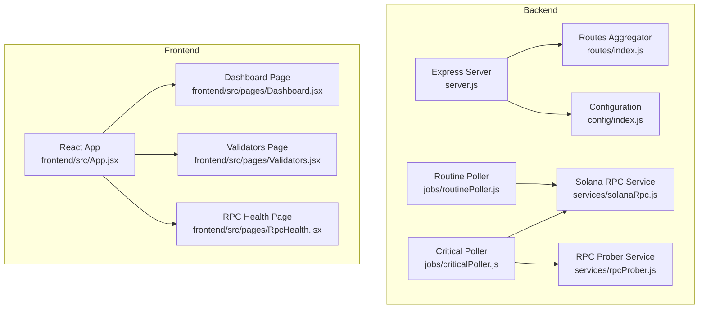
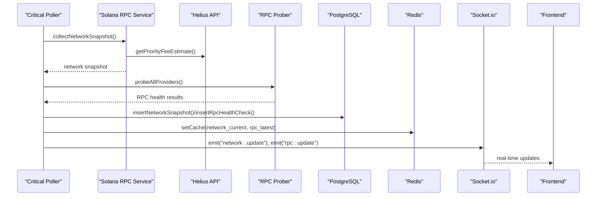
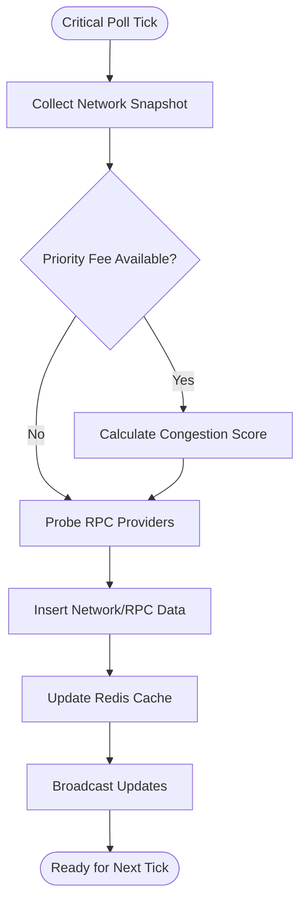
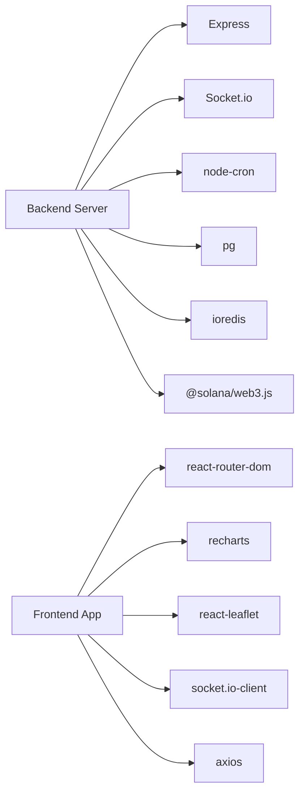

# Project Overview

<cite>
**Referenced Files in This Document**
- [server.js](file://backend/server.js)
- [index.js](file://backend/src/config/index.js)
- [index.js](file://backend/src/routes/index.js)
- [solanaRpc.js](file://backend/src/services/solanaRpc.js)
- [rpcProber.js](file://backend/src/services/rpcProber.js)
- [criticalPoller.js](file://backend/src/jobs/criticalPoller.js)
- [routinePoller.js](file://backend/src/jobs/routinePoller.js)
- [Dashboard.jsx](file://frontend/src/pages/Dashboard.jsx)
- [Validators.jsx](file://frontend/src/pages/Validators.jsx)
- [RpcHealth.jsx](file://frontend/src/pages/RpcHealth.jsx)
- [App.jsx](file://frontend/src/App.jsx)
- [package.json](file://backend/package.json)
- [package.json](file://frontend/package.json)
- [InfraWatch.txt](file://InfraWatch.txt)
</cite>

## Table of Contents
1. [Introduction](#introduction)
2. [Project Structure](#project-structure)
3. [Core Components](#core-components)
4. [Architecture Overview](#architecture-overview)
5. [Detailed Component Analysis](#detailed-component-analysis)
6. [Dependency Analysis](#dependency-analysis)
7. [Performance Considerations](#performance-considerations)
8. [Troubleshooting Guide](#troubleshooting-guide)
9. [Conclusion](#conclusion)

## Introduction
InfraWatch is a real-time monitoring platform designed to enhance transparency and reliability in the Solana ecosystem. It provides comprehensive network monitoring, RPC provider health tracking, and validator performance analytics through live dashboards and alerting capabilities. The platform targets three primary audiences:
- Validator operators: Track uptime, performance, and reputation signals to optimize operations and maintain eligibility.
- Application developers and builders: Ensure reliable RPC connectivity and choose optimal endpoints for their users.
- Retail stakers: Gain insights into validator rankings, delinquency risks, and performance metrics to make informed delegation decisions.

The core value proposition centers on delivering actionable, real-time data visualization and timely alerts, enabling stakeholders to react quickly to infrastructure changes and potential issues.

Why infrastructure monitoring matters in the Solana ecosystem:
- RPC reliability is a known operational challenge; inconsistent endpoints degrade application performance and user experience.
- Validator health directly impacts network security and staking rewards; visibility into uptime, skip rates, and delinquency helps mitigate risk.
- Network congestion and transaction confirmation times fluctuate; having live metrics supports better routing and user experience decisions.

## Project Structure
The project follows a modern full-stack architecture:
- Backend: Node.js/Express server with Socket.io for real-time updates, cron-based pollers for data collection, and PostgreSQL/Redis for persistence and caching.
- Frontend: React application with React Router for navigation, Zustand stores for state management, and Recharts for data visualization.

**Diagram sources**
- [server.js:1-128](file://backend/server.js#L1-L128)
- [index.js:1-68](file://backend/src/config/index.js#L1-L68)
- [index.js:1-24](file://backend/src/routes/index.js#L1-L24)
- [criticalPoller.js:1-108](file://backend/src/jobs/criticalPoller.js#L1-L108)
- [routinePoller.js:1-116](file://backend/src/jobs/routinePoller.js#L1-L116)
- [solanaRpc.js:1-340](file://backend/src/services/solanaRpc.js#L1-L340)
- [rpcProber.js:1-342](file://backend/src/services/rpcProber.js#L1-L342)
- [App.jsx:1-31](file://frontend/src/App.jsx#L1-L31)
- [Dashboard.jsx:1-84](file://frontend/src/pages/Dashboard.jsx#L1-L84)
- [Validators.jsx:1-179](file://frontend/src/pages/Validators.jsx#L1-L179)
- [RpcHealth.jsx:1-153](file://frontend/src/pages/RpcHealth.jsx#L1-L153)

**Section sources**
- [server.js:1-128](file://backend/server.js#L1-L128)
- [index.js:1-68](file://backend/src/config/index.js#L1-L68)
- [index.js:1-24](file://backend/src/routes/index.js#L1-L24)
- [App.jsx:1-31](file://frontend/src/App.jsx#L1-L31)

## Core Components
- Real-time data pipeline: Two cron-based pollers continuously collect network, RPC, and validator data, persist it, and broadcast updates via WebSocket.
- Network monitoring: Live metrics including TPS, slot latency, epoch progress, delinquent validators, and congestion scores.
- RPC health tracking: Multi-provider latency, uptime, and health status with recommendations.
- Validator analytics: Rankings, performance indicators, and change detection for commissions.
- Frontend dashboards: Interactive cards, charts, and tables powered by WebSocket updates and API endpoints.

**Section sources**
- [criticalPoller.js:1-108](file://backend/src/jobs/criticalPoller.js#L1-L108)
- [routinePoller.js:1-116](file://backend/src/jobs/routinePoller.js#L1-L116)
- [solanaRpc.js:1-340](file://backend/src/services/solanaRpc.js#L1-L340)
- [rpcProber.js:1-342](file://backend/src/services/rpcProber.js#L1-L342)
- [Dashboard.jsx:1-84](file://frontend/src/pages/Dashboard.jsx#L1-L84)
- [Validators.jsx:1-179](file://frontend/src/pages/Validators.jsx#L1-L179)
- [RpcHealth.jsx:1-153](file://frontend/src/pages/RpcHealth.jsx#L1-L153)

## Architecture Overview
InfraWatch integrates a real-time backend with a reactive frontend:
- Backend initializes configuration, starts WebSocket, mounts routes, and launches pollers.
- Pollers gather data from Solana RPC, external APIs, and multiple RPC endpoints, then write to PostgreSQL and Redis caches.
- Frontend subscribes to WebSocket events and renders live metrics and analytics.

**Diagram sources**
- [criticalPoller.js:21-100](file://backend/src/jobs/criticalPoller.js#L21-L100)
- [solanaRpc.js:275-328](file://backend/src/services/solanaRpc.js#L275-L328)
- [rpcProber.js:140-180](file://backend/src/services/rpcProber.js#L140-L180)
- [server.js:80-107](file://backend/server.js#L80-L107)
- [Dashboard.jsx:28-47](file://frontend/src/pages/Dashboard.jsx#L28-L47)
- [RpcHealth.jsx:23-39](file://frontend/src/pages/RpcHealth.jsx#L23-L39)

## Detailed Component Analysis

### Backend Entry Point and Routing
- Initializes Express, applies security and compression middleware, sets up CORS, and registers health check and API routes.
- Starts WebSocket server and data layer initialization, then launches critical and routine pollers.

**Section sources**
- [server.js:33-107](file://backend/server.js#L33-L107)
- [index.js:16-24](file://backend/src/routes/index.js#L16-L24)

### Configuration Management
- Centralized configuration loads environment variables with sensible defaults for Solana RPC, validators.app API, database, Redis, polling intervals, and CORS.

**Section sources**
- [index.js:27-65](file://backend/src/config/index.js#L27-L65)

### Real-Time Data Pipeline
- Critical poller (every 30 seconds): collects network snapshot, enhances with priority fees, probes RPC providers, writes to DB and Redis, and emits WebSocket updates.
- Routine poller (every 5 minutes): fetches top validators, detects commission changes, upserts data, writes snapshots, updates caches, and emits alerts.

**Diagram sources**
- [criticalPoller.js:21-100](file://backend/src/jobs/criticalPoller.js#L21-L100)
- [solanaRpc.js:275-328](file://backend/src/services/solanaRpc.js#L275-L328)
- [rpcProber.js:140-180](file://backend/src/services/rpcProber.js#L140-L180)

**Section sources**
- [criticalPoller.js:17-100](file://backend/src/jobs/criticalPoller.js#L17-L100)
- [routinePoller.js:16-108](file://backend/src/jobs/routinePoller.js#L16-L108)

### Network Monitoring Service
- Provides Solana RPC data collection including health status, TPS, slot latency estimation, epoch info, delinquent validators, and average confirmation time.
- Calculates a congestion score combining TPS, priority fees, and slot latency.

**Section sources**
- [solanaRpc.js:20-340](file://backend/src/services/solanaRpc.js#L20-L340)

### RPC Health Prober
- Probes multiple RPC providers (public and premium) for latency, health, and slot height.
- Maintains rolling statistics (percentiles, uptime) and identifies the best-performing healthy provider.

**Section sources**
- [rpcProber.js:75-342](file://backend/src/services/rpcProber.js#L75-L342)

### Frontend Dashboards and Navigation
- React Router routes define pages for Dashboard, Validators, RPC Health, Data Center Map, MEV Tracker, Bags Ecosystem, and Alerts.
- Dashboard page composes multiple metric cards and charts, initializing WebSocket and fetching network data on mount.
- Validators page displays top validators with sorting, selection, and detail panels.
- RPC Health page shows provider status, recommendations, and sortable tables.

**Section sources**
- [App.jsx:12-28](file://frontend/src/App.jsx#L12-L28)
- [Dashboard.jsx:19-83](file://frontend/src/pages/Dashboard.jsx#L19-L83)
- [Validators.jsx:8-179](file://frontend/src/pages/Validators.jsx#L8-L179)
- [RpcHealth.jsx:8-153](file://frontend/src/pages/RpcHealth.jsx#L8-L153)

## Dependency Analysis
- Backend dependencies include Express, Socket.io, cron, PostgreSQL driver, Redis client, and Solana web3 library.
- Frontend dependencies include React, React Router, Socket.io client, Recharts, and React Leaflet for map views.

**Diagram sources**
- [package.json:22-34](file://backend/package.json#L22-L34)
- [package.json:12-26](file://frontend/package.json#L12-L26)

**Section sources**
- [package.json:1-36](file://backend/package.json#L1-L36)
- [package.json:1-39](file://frontend/package.json#L1-L39)

## Performance Considerations
- Polling cadence: Critical poller runs every 30 seconds for near-real-time updates; routine poller runs every 5 minutes for less time-sensitive data.
- Concurrency: Network snapshot and RPC probing use concurrent requests to minimize latency.
- Caching: Redis caches recent network and RPC data to reduce database load and improve response times.
- Graceful degradation: Database and Redis failures are handled without crashing the backend, ensuring continuous operation.

[No sources needed since this section provides general guidance]

## Troubleshooting Guide
- Health checks: Use the backend health endpoint to confirm service availability and environment details.
- Logs: Review server logs for graceful shutdown messages and warnings during database/Redis unavailability.
- Frontend connectivity: Verify WebSocket connections and retry mechanisms on data loading errors.
- Environment configuration: Ensure required environment variables are set for RPC endpoints, API keys, database, and Redis.

**Section sources**
- [server.js:61-124](file://backend/server.js#L61-L124)
- [index.js:8-13](file://backend/src/config/index.js#L8-L13)

## Conclusion
InfraWatch delivers a comprehensive, real-time monitoring solution tailored to the needs of the Solana ecosystem. By combining live network metrics, RPC health tracking, and validator analytics with intuitive dashboards and alerts, it empowers validator operators, app builders, and retail stakers to make informed decisions and maintain operational excellence. Its robust backend architecture, resilient data pipeline, and reactive frontend provide a solid foundation for continued growth and feature expansion.