# Real-time Data Flow

<cite>
**Referenced Files in This Document**
- [server.js](file://backend/server.js)
- [criticalPoller.js](file://backend/src/jobs/criticalPoller.js)
- [routinePoller.js](file://backend/src/jobs/routinePoller.js)
- [solanaRpc.js](file://backend/src/services/solanaRpc.js)
- [helius.js](file://backend/src/services/helius.js)
- [rpcProber.js](file://backend/src/services/rpcProber.js)
- [validatorsApp.js](file://backend/src/services/validatorsApp.js)
- [queries.js](file://backend/src/models/queries.js)
- [redis.js](file://backend/src/models/redis.js)
- [cacheKeys.js](file://backend/src/models/cacheKeys.js)
- [index.js](file://backend/src/websocket/index.js)
- [index.js](file://backend/src/config/index.js)
- [useWebSocket.js](file://frontend/src/hooks/useWebSocket.js)
- [networkStore.js](file://frontend/src/stores/networkStore.js)
- [rpcStore.js](file://frontend/src/stores/rpcStore.js)
- [validatorStore.js](file://frontend/src/stores/validatorStore.js)
</cite>

## Update Summary
**Changes Made**
- Enhanced WebSocket communication module with centralized broadcast utilities and room-based messaging
- Expanded Redis caching strategies with TTL management and improved cache key organization
- Improved data normalization capabilities in validators service with enhanced validator schema mapping
- Strengthened real-time state management with centralized WebSocket event handling

## Table of Contents
1. [Introduction](#introduction)
2. [Project Structure](#project-structure)
3. [Core Components](#core-components)
4. [Architecture Overview](#architecture-overview)
5. [Detailed Component Analysis](#detailed-component-analysis)
6. [Dependency Analysis](#dependency-analysis)
7. [Performance Considerations](#performance-considerations)
8. [Troubleshooting Guide](#troubleshooting-guide)
9. [Conclusion](#conclusion)

## Introduction
This document explains InfraWatch's real-time data flow architecture. It covers the data collection pipeline from critical pollers and external APIs, data processing and persistence, caching strategies, WebSocket broadcasting for live updates, client-side state management, background job scheduling, synchronization patterns, and performance optimizations for real-time delivery.

## Project Structure
The backend is organized around a modular architecture:
- Entry point initializes HTTP server, Socket.io, middleware, routes, and data layer initialization.
- Jobs orchestrate periodic data collection and broadcasting.
- Services encapsulate external API integrations and internal computations.
- Models provide database access and Redis caching.
- Frontend integrates WebSocket events with Zustand stores for reactive UI updates.

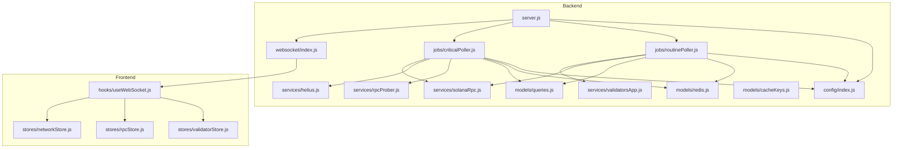

**Diagram sources**
- [server.js:1-128](file://backend/server.js#L1-L128)
- [criticalPoller.js:1-129](file://backend/src/jobs/criticalPoller.js#L1-L129)
- [routinePoller.js:1-129](file://backend/src/jobs/routinePoller.js#L1-L129)
- [solanaRpc.js:1-359](file://backend/src/services/solanaRpc.js#L1-L359)
- [helius.js:1-188](file://backend/src/services/helius.js#L1-L188)
- [rpcProber.js:1-342](file://backend/src/services/rpcProber.js#L1-L342)
- [validatorsApp.js:1-416](file://backend/src/services/validatorsApp.js#L1-L416)
- [queries.js:1-459](file://backend/src/models/queries.js#L1-L459)
- [redis.js:1-161](file://backend/src/models/redis.js#L1-L161)
- [cacheKeys.js:1-51](file://backend/src/models/cacheKeys.js#L1-L51)
- [index.js](file://backend/src/websocket/index.js:1-81)
- [index.js](file://backend/src/config/index.js:1-68)
- [useWebSocket.js:1-73](file://frontend/src/hooks/useWebSocket.js#L1-L73)
- [networkStore.js:1-48](file://frontend/src/stores/networkStore.js#L1-L48)
- [rpcStore.js:1-16](file://frontend/src/stores/rpcStore.js#L1-L16)
- [validatorStore.js:1-28](file://frontend/src/stores/validatorStore.js#L1-L28)

**Section sources**
- [server.js:1-128](file://backend/server.js#L1-L128)
- [index.js](file://backend/src/config/index.js:1-68)

## Core Components
- Background jobs: Critical and routine pollers schedule periodic data collection, processing, persistence, caching, and broadcasting.
- External integrations: Solana RPC, Helius API, RPC provider probing, and Validators.app API.
- Data access and caching: PostgreSQL via parameterized queries and Redis for fast reads/writes.
- Real-time messaging: Socket.io server with centralized connection lifecycle management and event broadcasting utilities.
- Frontend state: React hooks and Zustand stores subscribe to WebSocket events and manage UI state.

**Section sources**
- [criticalPoller.js:1-129](file://backend/src/jobs/criticalPoller.js#L1-L129)
- [routinePoller.js:1-129](file://backend/src/jobs/routinePoller.js#L1-L129)
- [solanaRpc.js:1-359](file://backend/src/services/solanaRpc.js#L1-L359)
- [helius.js:1-188](file://backend/src/services/helius.js#L1-L188)
- [rpcProber.js:1-342](file://backend/src/services/rpcProber.js#L1-L342)
- [validatorsApp.js:1-416](file://backend/src/services/validatorsApp.js#L1-L416)
- [queries.js:1-459](file://backend/src/models/queries.js#L1-L459)
- [redis.js:1-161](file://backend/src/models/redis.js#L1-L161)
- [index.js](file://backend/src/websocket/index.js:1-81)
- [useWebSocket.js:1-73](file://frontend/src/hooks/useWebSocket.js#L1-L73)
- [networkStore.js:1-48](file://frontend/src/stores/networkStore.js#L1-L48)

## Architecture Overview
The system follows a publish-subscribe pattern with centralized WebSocket communication:
- Pollers collect data, compute metrics, persist to PostgreSQL, cache in Redis, and emit events via Socket.io.
- Clients connect via WebSocket, receive live updates, and update local state through stores.
- Configuration drives external endpoints, intervals, and feature toggles.
- Centralized WebSocket utilities provide both global and room-specific broadcasting capabilities.

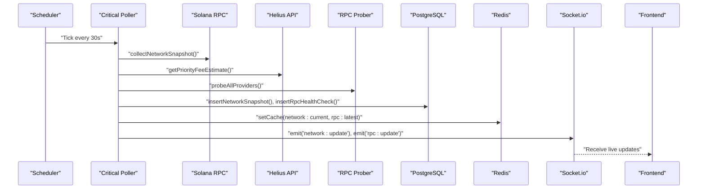

**Diagram sources**
- [criticalPoller.js:22-124](file://backend/src/jobs/criticalPoller.js#L22-L124)
- [solanaRpc.js:289-347](file://backend/src/services/solanaRpc.js#L289-L347)
- [helius.js:13-70](file://backend/src/services/helius.js#L13-L70)
- [rpcProber.js:140-180](file://backend/src/services/rpcProber.js#L140-L180)
- [queries.js:27-118](file://backend/src/models/queries.js#L27-L118)
- [redis.js:99-112](file://backend/src/models/redis.js#L99-L112)
- [index.js](file://backend/src/websocket/index.js:48-52)
- [useWebSocket.js:63-66](file://frontend/src/hooks/useWebSocket.js#L63-L66)

## Detailed Component Analysis

### Enhanced WebSocket Communication System
The WebSocket module now provides centralized communication utilities with enhanced capabilities:

- **Centralized Setup**: Socket.io initialization with connection tracking, error handling, and global broadcast utilities.
- **Room-based Messaging**: Support for broadcasting to specific rooms for targeted client groups.
- **Connection Management**: Real-time connection counting and lifecycle management.
- **Event Broadcasting**: Both global and room-specific event emission for flexible client targeting.

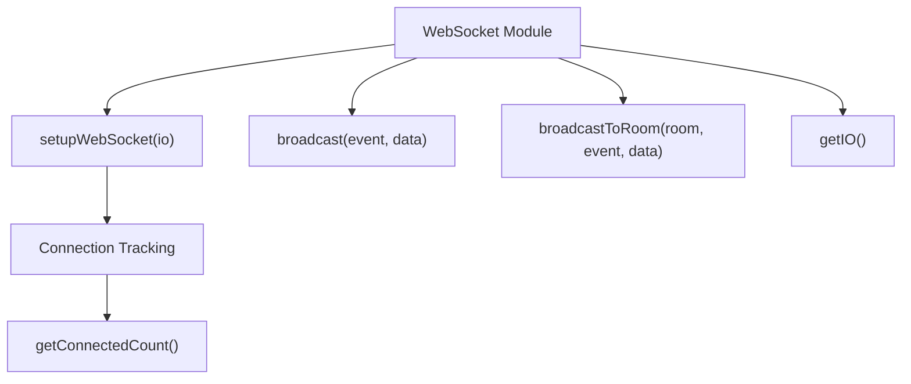

**Diagram sources**
- [index.js](file://backend/src/websocket/index.js:13-81)

**Section sources**
- [index.js](file://backend/src/websocket/index.js:1-81)

### Advanced Redis Caching Strategy
Redis implementation now features comprehensive caching with TTL management and centralized key organization:

- **Lazy Initialization**: Connection established on-demand with retry strategy and connection lifecycle logging.
- **JSON Serialization**: Automatic JSON parsing and stringification for cache values.
- **TTL Management**: Configurable time-to-live values for different cache categories.
- **Centralized Key Management**: Organized cache key constants with helper functions for dynamic keys.

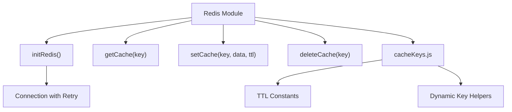

**Diagram sources**
- [redis.js:16-161](file://backend/src/models/redis.js#L16-L161)
- [cacheKeys.js:6-51](file://backend/src/models/cacheKeys.js#L6-L51)

**Section sources**
- [redis.js:1-161](file://backend/src/models/redis.js#L1-L161)
- [cacheKeys.js:1-51](file://backend/src/models/cacheKeys.js#L1-L51)

### Enhanced Data Normalization Capabilities
Validators service now includes comprehensive data normalization with enhanced schema mapping:

- **Comprehensive Field Mapping**: Extensive normalization from Validators.app format to internal schema.
- **Data Type Conversion**: Automatic conversion of stake amounts from lamports to SOL.
- **Conditional Field Handling**: Graceful handling of missing or optional fields.
- **Historical Timestamps**: Automatic timestamp generation for data freshness tracking.

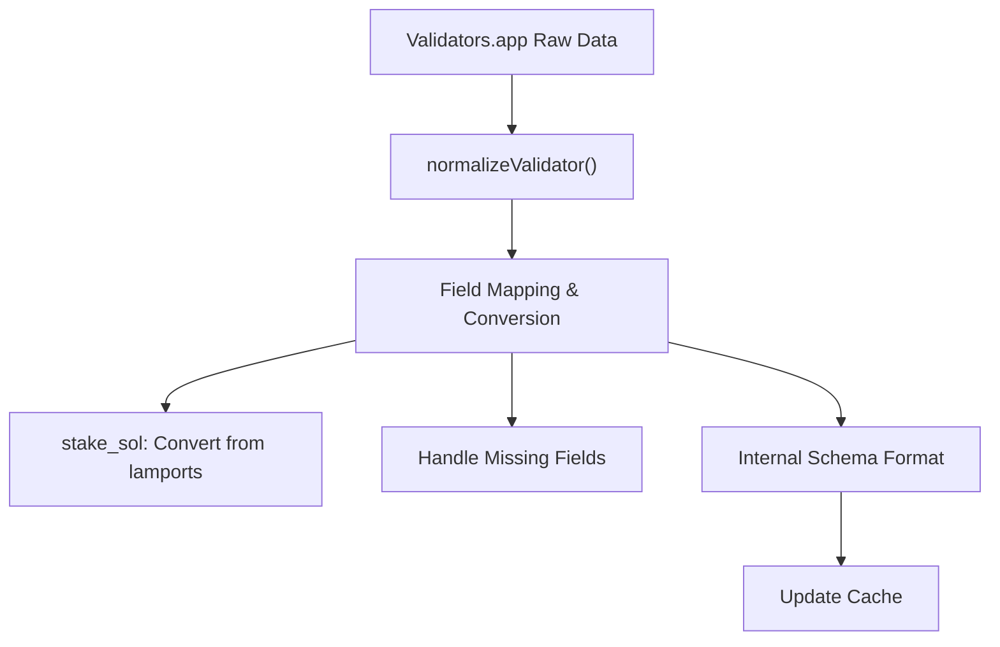

**Diagram sources**
- [validatorsApp.js:156-179](file://backend/src/services/validatorsApp.js#L156-L179)

**Section sources**
- [validatorsApp.js:156-179](file://backend/src/services/validatorsApp.js#L156-L179)

### Data Collection Pipeline
- Critical Poller (every 30 seconds):
  - Gathers network snapshot (TPS, slot, epoch, delinquency, congestion).
  - Enriches with Helius priority fees to compute congestion score.
  - Probes RPC providers for health and latency.
  - Writes to PostgreSQL and caches in Redis.
  - Broadcasts updates via Socket.io.

- Routine Poller (every 5 minutes):
  - Fetches top validators from Validators.app with rate limiting.
  - Detects commission changes and persists snapshots.
  - Updates validator cache and epoch info cache.
  - Emits alerts for significant changes.

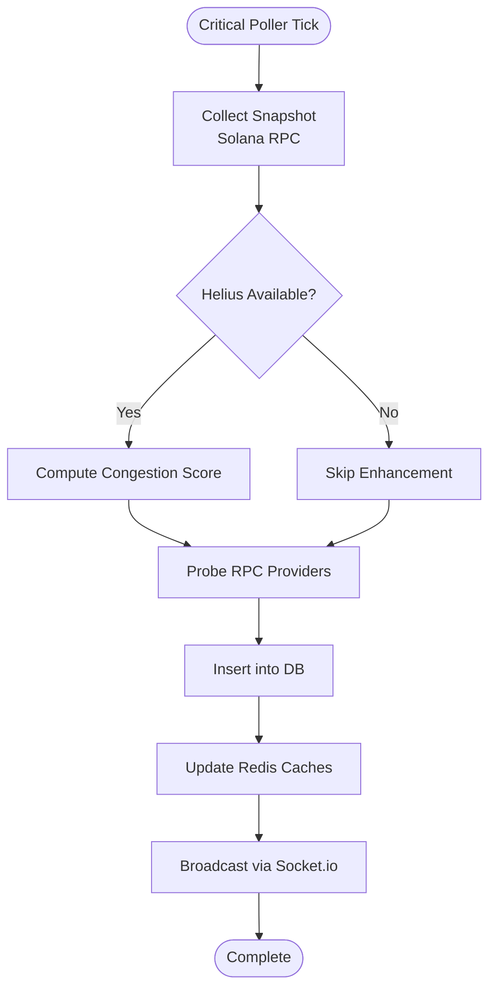

**Diagram sources**
- [criticalPoller.js:32-115](file://backend/src/jobs/criticalPoller.js#L32-L115)
- [solanaRpc.js:289-347](file://backend/src/services/solanaRpc.js#L289-L347)
- [helius.js:13-70](file://backend/src/services/helius.js#L13-L70)
- [rpcProber.js:140-180](file://backend/src/services/rpcProber.js#L140-L180)
- [queries.js:27-118](file://backend/src/models/queries.js#L27-L118)
- [redis.js:99-112](file://backend/src/models/redis.js#L99-L112)
- [index.js](file://backend/src/websocket/index.js:48-52)

**Section sources**
- [criticalPoller.js:17-124](file://backend/src/jobs/criticalPoller.js#L17-L124)
- [routinePoller.js:16-123](file://backend/src/jobs/routinePoller.js#L16-L123)

### External API Integrations
- Solana RPC:
  - Health, TPS, slot progression, epoch info, delinquent validators, and confirmation time.
  - Calculates congestion score combining TPS, priority fees, and slot latency.

- Helius:
  - Priority fee estimates for congestion modeling.
  - Optional enhanced TPS and account info retrieval.

- RPC Prober:
  - Concurrently probes multiple providers (public/premium).
  - Tracks latency percentiles, uptime, and incidents.

- Validators.app:
  - Rate-limited fetch of validators with normalization and caching.
  - Detects commission changes and supports historical snapshots.

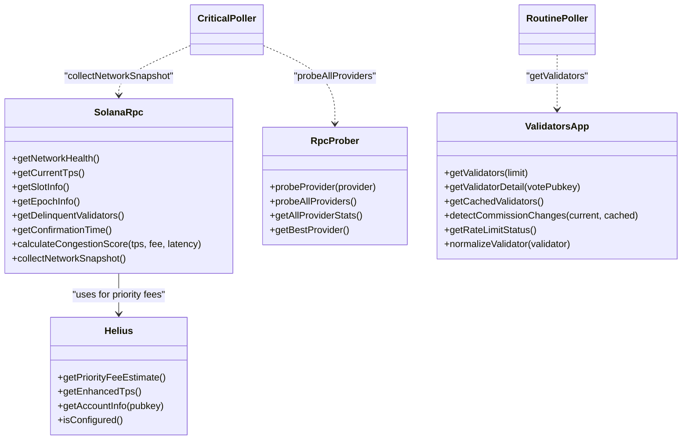

**Diagram sources**
- [solanaRpc.js:16-347](file://backend/src/services/solanaRpc.js#L16-L347)
- [helius.js:13-187](file://backend/src/services/helius.js#L13-L187)
- [rpcProber.js:75-307](file://backend/src/services/rpcProber.js#L75-L307)
- [validatorsApp.js:186-416](file://backend/src/services/validatorsApp.js#L186-L416)
- [criticalPoller.js:32-46](file://backend/src/jobs/criticalPoller.js#L32-L46)
- [routinePoller.js:30-31](file://backend/src/jobs/routinePoller.js#L30-L31)

**Section sources**
- [solanaRpc.js:16-347](file://backend/src/services/solanaRpc.js#L16-L347)
- [helius.js:13-187](file://backend/src/services/helius.js#L13-L187)
- [rpcProber.js:75-307](file://backend/src/services/rpcProber.js#L75-L307)
- [validatorsApp.js:186-416](file://backend/src/services/validatorsApp.js#L186-L416)

### Data Processing and Persistence
- PostgreSQL:
  - Parameterized inserts for network snapshots, RPC health checks, validators, and validator snapshots.
  - Queries for latest snapshots, provider histories, top validators, and alerts.

- Redis:
  - Lazy-initialized client with retry strategy and connection lifecycle logging.
  - JSON serialization for cache values with TTL management.
  - Cache keys centralized for network, RPC, validators, and history.

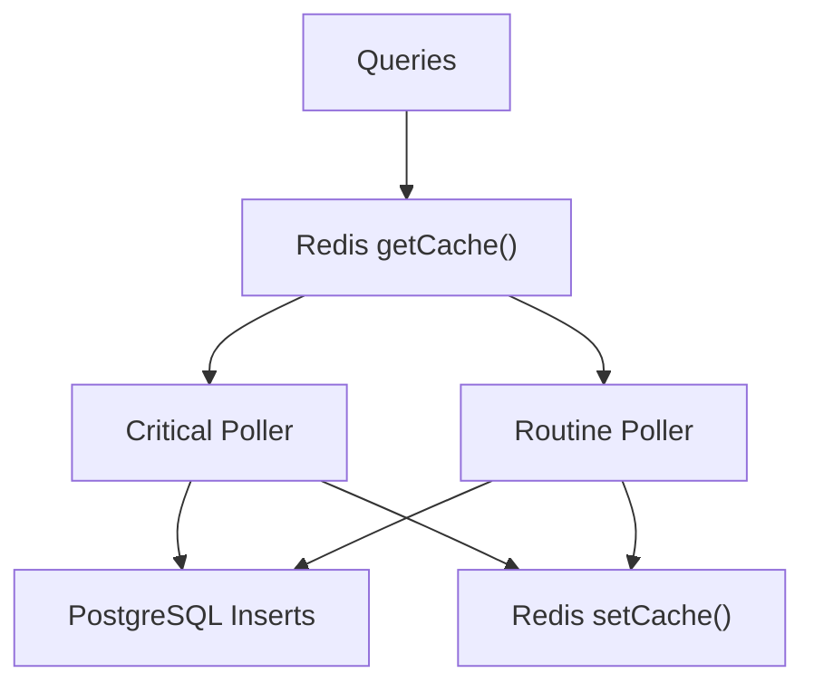

**Diagram sources**
- [queries.js:27-458](file://backend/src/models/queries.js#L27-L458)
- [redis.js:99-131](file://backend/src/models/redis.js#L99-L131)
- [cacheKeys.js:6-48](file://backend/src/models/cacheKeys.js#L6-L48)
- [criticalPoller.js:49-86](file://backend/src/jobs/criticalPoller.js#L49-L86)
- [routinePoller.js:37-70](file://backend/src/jobs/routinePoller.js#L37-L70)

**Section sources**
- [queries.js:27-458](file://backend/src/models/queries.js#L27-L458)
- [redis.js:16-161](file://backend/src/models/redis.js#L16-L161)
- [cacheKeys.js:6-48](file://backend/src/models/cacheKeys.js#L6-L48)

### WebSocket Broadcasting and Client Management
- Server:
  - Socket.io initialized with CORS and middleware-friendly configuration.
  - Connection tracking, error handling, and global broadcast utilities.
  - Exposes IO instance for jobs to emit events.

- Client:
  - React hook connects to Socket.io with fallback transports.
  - Subscribes to network and RPC update events.
  - Updates Zustand stores for reactive UI rendering.

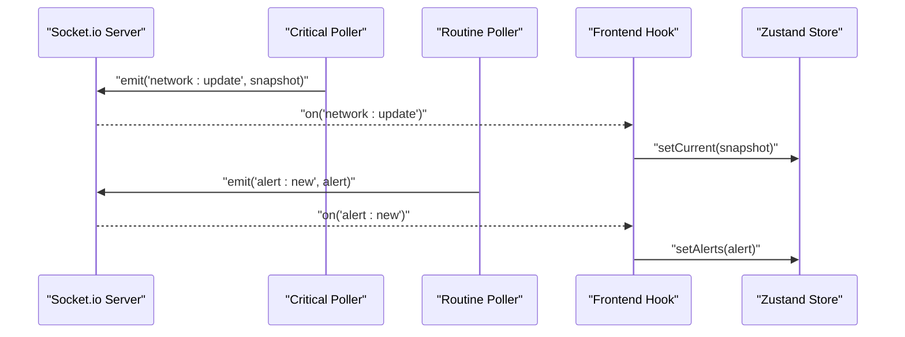

**Diagram sources**
- [index.js](file://backend/src/websocket/index.js:13-52)
- [criticalPoller.js:110-113](file://backend/src/jobs/criticalPoller.js#L110-L113)
- [routinePoller.js:110-113](file://backend/src/jobs/routinePoller.js#L110-L113)
- [useWebSocket.js:8-28](file://frontend/src/hooks/useWebSocket.js#L8-L28)
- [networkStore.js:17](file://frontend/src/stores/networkStore.js#L17)

**Section sources**
- [index.js](file://backend/src/websocket/index.js:13-81)
- [useWebSocket.js:8-28](file://frontend/src/hooks/useWebSocket.js#L8-L28)
- [networkStore.js:3-22](file://frontend/src/stores/networkStore.js#L3-L22)

### Real-time State Management
- Network store tracks current snapshot, history, epoch info, connection state, and last update.
- RPC store manages provider list, recommendation, and loading/error states.
- Validator store handles list, selection, sorting, and pagination.

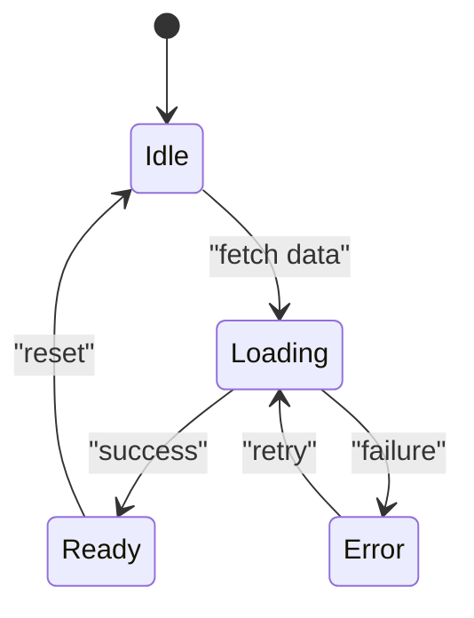

**Diagram sources**
- [networkStore.js:3-22](file://frontend/src/stores/networkStore.js#L3-L22)
- [rpcStore.js:3-13](file://frontend/src/stores/rpcStore.js#L3-L13)
- [validatorStore.js:3-25](file://frontend/src/stores/validatorStore.js#L3-L25)

**Section sources**
- [networkStore.js:3-22](file://frontend/src/stores/networkStore.js#L3-L22)
- [rpcStore.js:3-13](file://frontend/src/stores/rpcStore.js#L3-L13)
- [validatorStore.js:3-25](file://frontend/src/stores/validatorStore.js#L3-L25)

## Dependency Analysis
- Configuration-driven:
  - Environment variables drive Solana endpoints, API keys, database and Redis URLs, polling intervals, and CORS.
- Coupling and cohesion:
  - Jobs depend on services and models; services depend on configuration and external APIs.
  - WebSocket module is decoupled from business logic and only emits events.
- External dependencies:
  - @solana/web3.js, axios, node-cron, ioredis, socket.io.

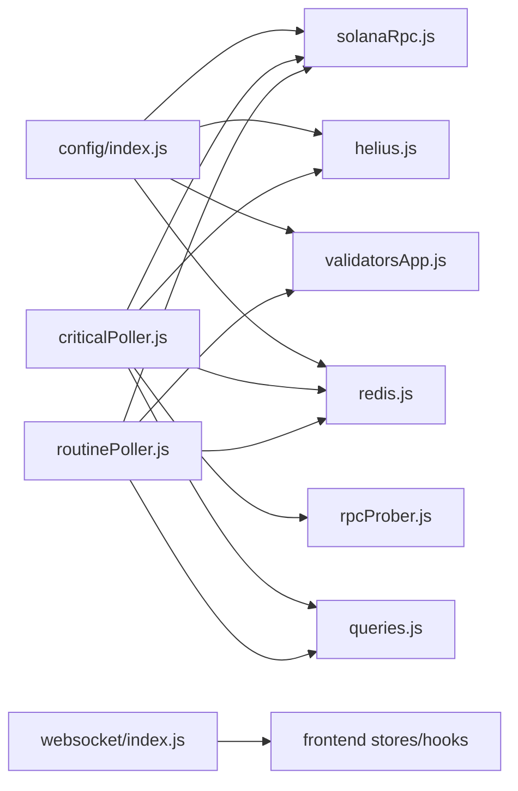

**Diagram sources**
- [index.js](file://backend/src/config/index.js:27-65)
- [solanaRpc.js:10](file://backend/src/services/solanaRpc.js#L10)
- [helius.js:6-7](file://backend/src/services/helius.js#L6-L7)
- [validatorsApp.js:6-7](file://backend/src/services/validatorsApp.js#L6-L7)
- [redis.js:6-7](file://backend/src/models/redis.js#L6-L7)
- [criticalPoller.js:8-13](file://backend/src/jobs/criticalPoller.js#L8-L13)
- [routinePoller.js:8-12](file://backend/src/jobs/routinePoller.js#L8-L12)
- [index.js](file://backend/src/websocket/index.js:6-7)

**Section sources**
- [index.js](file://backend/src/config/index.js:27-65)
- [criticalPoller.js:8-13](file://backend/src/jobs/criticalPoller.js#L8-L13)
- [routinePoller.js:8-12](file://backend/src/jobs/routinePoller.js#L8-L12)

## Performance Considerations
- Concurrency and batching:
  - Parallel RPC calls for network metrics and provider probing reduce latency.
  - Batch writes to PostgreSQL and Redis minimize round trips.
- Caching strategy:
  - Short TTLs for frequently changing metrics (network and RPC).
  - Longer TTLs for stable lists (validators) and epoch info.
- Graceful degradation:
  - Try/catch around DB and Redis operations prevents cascading failures.
  - Optional Helius integration avoids blocking when API key is missing.
- Transport optimization:
  - Socket.io configured with WebSocket and polling fallbacks for reliability.
- Rate limiting:
  - Validators.app requests are rate-limited to respect upstream quotas.
- Centralized WebSocket management:
  - Single point of control for connection lifecycle and event broadcasting.
  - Room-based messaging reduces unnecessary client notifications.

## Troubleshooting Guide
- Redis connectivity:
  - Lazy initialization logs connection events; check initial connect and ready callbacks.
  - Verify REDIS_URL environment variable and network access.

- Database availability:
  - Jobs wrap DB operations in try/catch and continue if unavailable.
  - Confirm DATABASE_URL and Postgres service status.

- External API issues:
  - Missing API keys disable Helius and Validators.app features.
  - Timeout and error handling in HTTP clients surface meaningful logs.

- WebSocket events:
  - Verify Socket.io server is initialized and emitting events.
  - Ensure frontend connects to the correct path and handles connection/disconnection events.

- Cache key validation:
  - Verify cache keys match expected patterns in cacheKeys.js.
  - Check TTL values for appropriate cache duration.

**Section sources**
- [redis.js:16-68](file://backend/src/models/redis.js#L16-L68)
- [redis.js:59-61](file://backend/src/models/redis.js#L59-L61)
- [index.js](file://backend/src/config/index.js:22-L25)
- [helius.js:14-18](file://backend/src/services/helius.js#L14-L18)
- [validatorsApp.js:116-149](file://backend/src/services/validatorsApp.js#L116-L149)
- [index.js](file://backend/src/websocket/index.js:16-L32)
- [useWebSocket.js:11-19](file://frontend/src/hooks/useWebSocket.js#L11-L19)

## Conclusion
InfraWatch's real-time architecture combines scheduled data collection, robust external API integrations, resilient persistence, and efficient caching with a reliable WebSocket broadcast layer. The enhanced centralized WebSocket communication provides improved connection management and event routing capabilities. The expanded Redis caching strategies offer more granular control over data retention and access patterns. The improved data normalization ensures consistent data formats across all components. The frontend consumes live events through a simple hook and Zustand stores, enabling responsive dashboards. The design emphasizes resilience, scalability, and maintainability through modular services, centralized configuration, and graceful error handling.